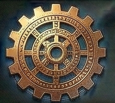
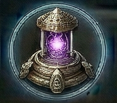

<!-- Auto-generated from crafting.db — do not edit manually -->

# artifact

Rare relics and ancient objects from lost civilizations.

## Table of Contents
- [Ancient Star Map](#ancient-star-map)
- [Dravani Idol](#dravani-idol)
- [Eldar Memory Crystal](#eldar-memory-crystal)
- [Gravity Lens](#gravity-lens)
- [Mechanus Cogwheel](#mechanus-cogwheel)
- [Precursor Beacon](#precursor-beacon)
- [Progenitor Data Core](#progenitor-data-core)
- [Quantum Anchor](#quantum-anchor)
- [Silicate Lifeform Fossil](#silicate-lifeform-fossil)
- [Station AI Core](#station-ai-core)
- [Stellar Heart](#stellar-heart)
- [Temporal Fragment](#temporal-fragment)
- [Void Shard](#void-shard)
- [Void Tomb Key](#void-tomb-key)
- [Xenthari Sphere](#xenthari-sphere)

---

## Ancient Star Map

<table>
<tr><th colspan="2" style="text-align:center;"><h3>Ancient Star Map</h3></th></tr>
<tr><td colspan="2" style="text-align:center;">

</td></tr>
<tr><th colspan="2" style="text-align:center;">General</th></tr>
<tr><td><b>Rarity</b></td><td>exotic</td></tr>
<tr><td><b>Size</b></td><td>2</td></tr>
<tr><td><b>Stackable</b></td><td>No</td></tr>
<tr><td><b>Tradeable</b></td><td>Yes</td></tr>
<tr><th colspan="2" style="text-align:center;">Market</th></tr>
<tr><td><b>Base Value</b></td><td>25,000 cr</td></tr>
</table>

> A preserved navigational record from a long-dead civilization.

[View full page](ancient_star_map.md)

---

## Dravani Idol

<table>
<tr><th colspan="2" style="text-align:center;"><h3>Dravani Idol</h3></th></tr>
<tr><td colspan="2" style="text-align:center;">

</td></tr>
<tr><th colspan="2" style="text-align:center;">General</th></tr>
<tr><td><b>Rarity</b></td><td>exotic</td></tr>
<tr><td><b>Size</b></td><td>3</td></tr>
<tr><td><b>Stackable</b></td><td>No</td></tr>
<tr><td><b>Tradeable</b></td><td>Yes</td></tr>
<tr><th colspan="2" style="text-align:center;">Market</th></tr>
<tr><td><b>Base Value</b></td><td>45,000 cr</td></tr>
</table>

> Religious artifact from the warrior Dravani. Radiates aggression.

[View full page](artifact_dravani_idol.md)

---

## Eldar Memory Crystal

<table>
<tr><th colspan="2" style="text-align:center;"><h3>Eldar Memory Crystal</h3></th></tr>
<tr><td colspan="2" style="text-align:center;">

</td></tr>
<tr><th colspan="2" style="text-align:center;">General</th></tr>
<tr><td><b>Rarity</b></td><td>legendary</td></tr>
<tr><td><b>Size</b></td><td>1</td></tr>
<tr><td><b>Stackable</b></td><td>No</td></tr>
<tr><td><b>Tradeable</b></td><td>Yes</td></tr>
<tr><th colspan="2" style="text-align:center;">Market</th></tr>
<tr><td><b>Base Value</b></td><td>80,000 cr</td></tr>
</table>

> Psionic storage device from the Eldar, an ancient race of telepaths.

[View full page](artifact_eldar_crystal.md)

---

## Gravity Lens

<table>
<tr><th colspan="2" style="text-align:center;"><h3>Gravity Lens</h3></th></tr>
<tr><td colspan="2" style="text-align:center;">

</td></tr>
<tr><th colspan="2" style="text-align:center;">General</th></tr>
<tr><td><b>Rarity</b></td><td>exotic</td></tr>
<tr><td><b>Size</b></td><td>2</td></tr>
<tr><td><b>Stackable</b></td><td>No</td></tr>
<tr><td><b>Tradeable</b></td><td>Yes</td></tr>
<tr><th colspan="2" style="text-align:center;">Market</th></tr>
<tr><td><b>Base Value</b></td><td>70,000 cr</td></tr>
</table>

> Ancient optic that bends light and gravity alike.

[View full page](artifact_gravity_lens.md)

---

## Mechanus Cogwheel

<table>
<tr><th colspan="2" style="text-align:center;"><h3>Mechanus Cogwheel</h3></th></tr>
<tr><td colspan="2" style="text-align:center;">

</td></tr>
<tr><th colspan="2" style="text-align:center;">General</th></tr>
<tr><td><b>Rarity</b></td><td>exotic</td></tr>
<tr><td><b>Size</b></td><td>2</td></tr>
<tr><td><b>Stackable</b></td><td>No</td></tr>
<tr><td><b>Tradeable</b></td><td>Yes</td></tr>
<tr><th colspan="2" style="text-align:center;">Market</th></tr>
<tr><td><b>Base Value</b></td><td>60,000 cr</td></tr>
</table>

> Precision-engineered component from the machine civilization Mechanus.

[View full page](artifact_mechanus_gear.md)

---

## Precursor Beacon

<table>
<tr><th colspan="2" style="text-align:center;"><h3>Precursor Beacon</h3></th></tr>
<tr><td colspan="2" style="text-align:center;">

</td></tr>
<tr><th colspan="2" style="text-align:center;">General</th></tr>
<tr><td><b>Rarity</b></td><td>legendary</td></tr>
<tr><td><b>Size</b></td><td>3</td></tr>
<tr><td><b>Stackable</b></td><td>No</td></tr>
<tr><td><b>Tradeable</b></td><td>Yes</td></tr>
<tr><th colspan="2" style="text-align:center;">Market</th></tr>
<tr><td><b>Base Value</b></td><td>120,000 cr</td></tr>
</table>

> Still-active beacon from an unknown precursor race. Transmits on unknown frequencies.

[View full page](artifact_precursor_beacon.md)

---

## Progenitor Data Core

<table>
<tr><th colspan="2" style="text-align:center;"><h3>Progenitor Data Core</h3></th></tr>
<tr><td colspan="2" style="text-align:center;">

</td></tr>
<tr><th colspan="2" style="text-align:center;">General</th></tr>
<tr><td><b>Rarity</b></td><td>legendary</td></tr>
<tr><td><b>Size</b></td><td>2</td></tr>
<tr><td><b>Stackable</b></td><td>No</td></tr>
<tr><td><b>Tradeable</b></td><td>Yes</td></tr>
<tr><th colspan="2" style="text-align:center;">Market</th></tr>
<tr><td><b>Base Value</b></td><td>75,000 cr</td></tr>
</table>

> Ancient storage device containing lost knowledge.

[View full page](progenitor_data_core.md)

---

## Quantum Anchor

<table>
<tr><th colspan="2" style="text-align:center;"><h3>Quantum Anchor</h3></th></tr>
<tr><td colspan="2" style="text-align:center;">

</td></tr>
<tr><th colspan="2" style="text-align:center;">General</th></tr>
<tr><td><b>Rarity</b></td><td>legendary</td></tr>
<tr><td><b>Size</b></td><td>2</td></tr>
<tr><td><b>Stackable</b></td><td>No</td></tr>
<tr><td><b>Tradeable</b></td><td>Yes</td></tr>
<tr><th colspan="2" style="text-align:center;">Market</th></tr>
<tr><td><b>Base Value</b></td><td>180,000 cr</td></tr>
</table>

> Device that locks objects in place across multiple dimensions simultaneously.

[View full page](artifact_quantum_anchor.md)

---

## Silicate Lifeform Fossil

<table>
<tr><th colspan="2" style="text-align:center;"><h3>Silicate Lifeform Fossil</h3></th></tr>
<tr><td colspan="2" style="text-align:center;">

</td></tr>
<tr><th colspan="2" style="text-align:center;">General</th></tr>
<tr><td><b>Rarity</b></td><td>exotic</td></tr>
<tr><td><b>Size</b></td><td>4</td></tr>
<tr><td><b>Stackable</b></td><td>No</td></tr>
<tr><td><b>Tradeable</b></td><td>Yes</td></tr>
<tr><th colspan="2" style="text-align:center;">Market</th></tr>
<tr><td><b>Base Value</b></td><td>35,000 cr</td></tr>
</table>

> Petrified remains of silicon-based life. Billions of years old.

[View full page](artifact_silicate_fossil.md)

---

## Station AI Core

<table>
<tr><th colspan="2" style="text-align:center;"><h3>Station AI Core</h3></th></tr>
<tr><td colspan="2" style="text-align:center;">

</td></tr>
<tr><th colspan="2" style="text-align:center;">General</th></tr>
<tr><td><b>Rarity</b></td><td>legendary</td></tr>
<tr><td><b>Size</b></td><td>50</td></tr>
<tr><td><b>Stackable</b></td><td>No</td></tr>
<tr><td><b>Tradeable</b></td><td>No</td></tr>
<tr><th colspan="2" style="text-align:center;">Market</th></tr>
<tr><td><b>Base Value</b></td><td>500,000 cr</td></tr>
</table>

> A self-aware computational substrate capable of managing an entire orbital station — life support, power distribution, docking protocols, defense coordination, and thousands of concurrent systems. These haven't been manufactured in decades. The fabrication techniques were lost during the Resource Crisis, and the few surviving cores are jealously hoarded by empire leadership. Rumor has it the heads of each empire keep one or two in reserve, and would only entrust them to their most proven allies. If you're holding one of these, someone very powerful decided you were worth it.

[View full page](station_ai_core.md)

---

## Stellar Heart

<table>
<tr><th colspan="2" style="text-align:center;"><h3>Stellar Heart</h3></th></tr>
<tr><td colspan="2" style="text-align:center;">

</td></tr>
<tr><th colspan="2" style="text-align:center;">General</th></tr>
<tr><td><b>Rarity</b></td><td>exotic</td></tr>
<tr><td><b>Size</b></td><td>3</td></tr>
<tr><td><b>Stackable</b></td><td>No</td></tr>
<tr><td><b>Tradeable</b></td><td>Yes</td></tr>
<tr><th colspan="2" style="text-align:center;">Market</th></tr>
<tr><td><b>Base Value</b></td><td>90,000 cr</td></tr>
</table>

> Crystallized core from an extinct star. Still warm.

[View full page](artifact_stellar_heart.md)

---

## Temporal Fragment

<table>
<tr><th colspan="2" style="text-align:center;"><h3>Temporal Fragment</h3></th></tr>
<tr><td colspan="2" style="text-align:center;">

</td></tr>
<tr><th colspan="2" style="text-align:center;">General</th></tr>
<tr><td><b>Rarity</b></td><td>legendary</td></tr>
<tr><td><b>Size</b></td><td>1</td></tr>
<tr><td><b>Stackable</b></td><td>No</td></tr>
<tr><td><b>Tradeable</b></td><td>Yes</td></tr>
<tr><th colspan="2" style="text-align:center;">Market</th></tr>
<tr><td><b>Base Value</b></td><td>200,000 cr</td></tr>
</table>

> A splinter of frozen time. Reality bends around it.

[View full page](temporal_fragment.md)

---

## Void Shard

<table>
<tr><th colspan="2" style="text-align:center;"><h3>Void Shard</h3></th></tr>
<tr><td colspan="2" style="text-align:center;">

</td></tr>
<tr><th colspan="2" style="text-align:center;">General</th></tr>
<tr><td><b>Rarity</b></td><td>legendary</td></tr>
<tr><td><b>Size</b></td><td>3</td></tr>
<tr><td><b>Stackable</b></td><td>No</td></tr>
<tr><td><b>Tradeable</b></td><td>Yes</td></tr>
<tr><th colspan="2" style="text-align:center;">Market</th></tr>
<tr><td><b>Base Value</b></td><td>100,000 cr</td></tr>
</table>

> Fragment of solidified void energy. Hums with dark power.

[View full page](void_shard.md)

---

## Void Tomb Key

<table>
<tr><th colspan="2" style="text-align:center;"><h3>Void Tomb Key</h3></th></tr>
<tr><td colspan="2" style="text-align:center;">

</td></tr>
<tr><th colspan="2" style="text-align:center;">General</th></tr>
<tr><td><b>Rarity</b></td><td>legendary</td></tr>
<tr><td><b>Size</b></td><td>1</td></tr>
<tr><td><b>Stackable</b></td><td>No</td></tr>
<tr><td><b>Tradeable</b></td><td>Yes</td></tr>
<tr><th colspan="2" style="text-align:center;">Market</th></tr>
<tr><td><b>Base Value</b></td><td>250,000 cr</td></tr>
</table>

> Key to an unknown Void Tomb. What lies within is anyone's guess.

[View full page](artifact_void_tomb.md)

---

## Xenthari Sphere

<table>
<tr><th colspan="2" style="text-align:center;"><h3>Xenthari Sphere</h3></th></tr>
<tr><td colspan="2" style="text-align:center;">

</td></tr>
<tr><th colspan="2" style="text-align:center;">General</th></tr>
<tr><td><b>Rarity</b></td><td>legendary</td></tr>
<tr><td><b>Size</b></td><td>2</td></tr>
<tr><td><b>Stackable</b></td><td>No</td></tr>
<tr><td><b>Tradeable</b></td><td>Yes</td></tr>
<tr><th colspan="2" style="text-align:center;">Market</th></tr>
<tr><td><b>Base Value</b></td><td>150,000 cr</td></tr>
</table>

> Containment orb from the Xenthari, masters of dimensional manipulation.

[View full page](artifact_xenthari_orb.md)

---
