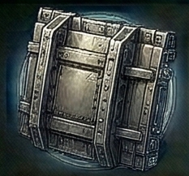

<!-- Auto-generated from crafting.db — do not edit manually -->

<table>
<tr><th colspan="2" style="text-align:center;"><h3>Capital Armor Plate</h3></th></tr>
<tr><td colspan="2" style="text-align:center;">

</td></tr>
<tr><th colspan="2" style="text-align:center;">General</th></tr>
<tr><td><b>Category</b></td><td>component</td></tr>
<tr><td><b>Rarity</b></td><td>rare</td></tr>
<tr><td><b>Size</b></td><td>20</td></tr>
<tr><td><b>Stackable</b></td><td>No</td></tr>
<tr><td><b>Tradeable</b></td><td>Yes</td></tr>
<tr><th colspan="2" style="text-align:center;">Market</th></tr>
<tr><td><b>Base Value</b></td><td>15,000 cr</td></tr>
</table>

> Massive reinforced plating for capital ships.

## Crafting

### Produced By

| Recipe | Qty | Crafting Time | Skills Required |
|--------|-----|---------------|-----------------|
| [Build Capital Armor Plate](craft_capital_armor_plate.md) | 1 | 60 ticks | Advanced Crafting 7 |
