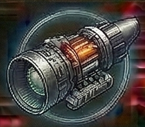

<!-- Auto-generated from crafting.db — do not edit manually -->

<table>
<tr><th colspan="2" style="text-align:center;"><h3>Engine Core</h3></th></tr>
<tr><td colspan="2" style="text-align:center;">

</td></tr>
<tr><th colspan="2" style="text-align:center;">General</th></tr>
<tr><td><b>Category</b></td><td>component</td></tr>
<tr><td><b>Rarity</b></td><td>uncommon</td></tr>
<tr><td><b>Size</b></td><td>3</td></tr>
<tr><td><b>Stackable</b></td><td>Yes</td></tr>
<tr><td><b>Tradeable</b></td><td>Yes</td></tr>
<tr><th colspan="2" style="text-align:center;">Market</th></tr>
<tr><td><b>Base Value</b></td><td>250 cr</td></tr>
</table>

> Propulsion system core assembly.

## Crafting

### Produced By

| Recipe | Qty | Crafting Time | Skills Required |
|--------|-----|---------------|-----------------|
| [Assemble Engine Core](craft_engine_core.md) | 1 | 10 ticks | Advanced Crafting 2 |

### Used In

| Recipe | Qty | Produces |
|--------|-----|----------|
| [Build Dark Matter Thruster](craft_outerrim_dark_thruster.md) | 1 | [Dark Matter Thruster](comp_outerrim_dark_thruster.md) |
| [Build Thruster Assembly](craft_thruster_assembly.md) | 1 | [Thruster Assembly](comp_thruster_assembly.md) |
| [Build Voidborn Phase Drive](craft_voidborn_phase_drive.md) | 1 | [Voidborn Phase Drive](comp_voidborn_phase_drive.md) |
