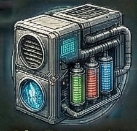
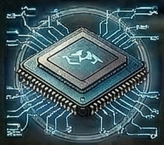
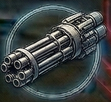
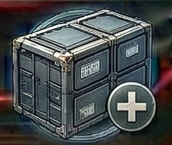
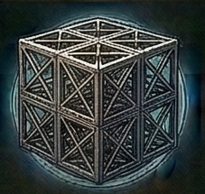
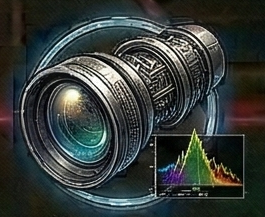
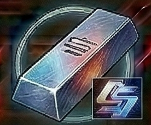
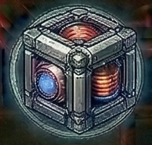
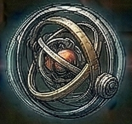

<!-- Auto-generated from crafting.db — do not edit manually -->

# component

Crafted parts and assemblies used to build ships, stations, and equipment.

## Table of Contents
- [Air Recycler](#comp_air_recycler)
- [Ammo Fabricator](#comp_ammo_fabricator)
- [Armor Plate](#comp_armor_plate)
- [Autopilot Core](#comp_autopilot_module)
- [Autopilot Module](#comp_autopilot)
- [Barrel Assembly](#comp_barrel_assembly)
- [Capital Armor Plate](#capital_armor_plate)
- [Capital Ship Frame](#comp_capital_frame)
- [Cargo Bay Expansion](#comp_cargo_expansion)
- [Cargo Container](#comp_cargo_container)
- [Cargo Superstructure](#comp_cargo_superstructure)
- [Communications Array](#comp_comm_array)
- [Crimson Ordnance Bay](#comp_crimson_ordnance_bay)
- [Crimson Siege Plating](#comp_crimson_siege_plating)
- [Cryogenic Pod](#comp_cryogenic_pod)
- [Cryogenic Pod](#comp_cryo_pod)
- [Cryogenic Storage](#comp_cryo_storage)
- [Dark Matter Cell](#comp_dark_matter_cell)
- [Dark Matter Thruster](#comp_outerrim_dark_thruster)
- [Deep Core Survey Lens](#comp_deep_core_lens)
- [Defense Platform](#comp_defense_platform)
- [Defense Turret](#comp_defense_turret)
- [Dimensional Anchor](#comp_dimensional_anchor)
- [Docking Ring](#comp_docking_ring)
- [Drone AI Core](#comp_drone_ai_core)
- [Drone Bay Module](#comp_drone_bay)
- [Drone Chassis](#comp_drone_chassis)
- [Drone Command Module](#comp_drone_command)
- [Drone Comms Module](#comp_drone_communication)
- [Drone Mining Laser](#comp_drone_mining_laser)
- [Drone Repair Arm](#comp_drone_repair_arm)
- [Drone Sensor Suite](#comp_drone_sensor)
- [Drone Weapon Mount](#comp_drone_weapon)
- [Engine Core](#comp_engine_core)
- [Escape Pod](#comp_escape_pod)
- [Frontier Survival Kit](#comp_outerrim_frontier_kit)
- [Fuel Tank](#comp_fuel_tank)
- [Fury-Tempered Plating](#comp_fury_plating)
- [Galactic Standard Alloy](#comp_galactic_alloy)
- [Gravity Generator](#comp_gravity_generator)
- [Habitation Module](#comp_hab_module)
- [Hangar Bay Module](#comp_hangar_bay)
- [Hazmat Container](#comp_hazmat_container)
- [Heat Sink](#comp_heat_sink)
- [Hull Plating](#comp_hull_plate)
- [Inertial Gyroscope](#comp_gyroscope)
- [Ion Emitter](#comp_ion_emitter)
- [Jump Calculator](#comp_jump_calculator)
- [Jump Coil](#comp_jump_coil)
- [Jump Drive Core](#jump_drive_core)
- [Laser Focus Array](#comp_laser_focus)
- [Laser Focusing Lens](#comp_laser_lens)
- [Life Support Array](#comp_life_support_array)
- [Life Support Unit](#comp_life_support)
- [Life Support Unit](#comp_life_support_unit)
- [Medical Bay Module](#comp_medical_bay)
- [Micro-Thruster Array](#comp_micro_thruster)
- [Missile Guidance Unit](#comp_missile_guidance)
- [Navigation Array](#comp_nav_array)
- [Navigation Core](#comp_navigation_core)
- [Nebula Cargo Matrix](#comp_nebula_cargo_matrix)
- [Nebula Prism Computer](#comp_nebula_prism_computer)
- [Neon Signaling Array](#comp_neon_signaling_array)
- [Ore Hopper](#comp_ore_hopper)
- [Pan-Galactic Matrix](#comp_pan_galactic_matrix)
- [Phase Array](#comp_phase_array)
- [Phase Drive](#comp_phase_drive)
- [Plasma Injector](#comp_plasma_injector)
- [Power Cell](#comp_power_cell)
- [Power Core](#power_core)
- [Power Distribution Grid](#comp_power_grid)
- [Precision Optic](#comp_precision_optic)
- [Pressure Seal](#comp_pressure_seal)
- [Processing Core](#comp_cpu_core)
- [Quantum Entangler](#comp_quantum_entangler)
- [Quantum Processor](#comp_quantum_processor)
- [Quantum Stabilizer](#comp_quantum_stabilizer)
- [Railgun Capacitor](#comp_railgun_capacitor)
- [Rare Salvage](#salvage_rare)
- [Reinforced Bulkhead](#comp_reinforced_bulkhead)
- [Repair Nanite Container](#comp_repair_nanites)
- [Salvage Components](#salvage_components)
- [Salvage Metal](#salvage_metal)
- [Secure Vault](#comp_secure_vault)
- [Sensor Array](#comp_sensor_array)
- [Sensor Cluster](#comp_sensor_cluster)
- [Sensor Package](#comp_sensor_package)
- [Shield Array](#comp_shield_array)
- [Shield Emitter](#comp_shield_emitter)
- [Shield Generator](#comp_shield_generator)
- [Shield Matrix](#comp_shield_matrix)
- [Singularity Core](#comp_singularity_core)
- [Solar Collector Array](#comp_solarian_solar_collector)
- [Solar Panel Array](#comp_solar_panel)
- [Solarian Logic Matrix](#comp_solarian_logic_matrix)
- [Station Reactor](#comp_station_reactor)
- [Station Reactor Core](#comp_reactor_core)
- [Swarm Controller](#comp_swarm_controller)
- [Targeting Computer](#comp_targeting_computer)
- [Temporal Stabilizer](#comp_temporal_stabilizer)
- [Threat Analyzer](#comp_threat_analyzer)
- [Thruster Assembly](#comp_thruster_assembly)
- [Thruster Nozzle](#comp_thruster_nozzle)
- [Tracking System](#comp_tracking_system)
- [Trade Authenticator](#comp_trade_authenticator)
- [Trade Cipher](#comp_trade_cipher)
- [Universal Nav Core](#comp_universal_nav_core)
- [Void Capacitor](#comp_void_capacitor)
- [Void Shield Matrix](#comp_void_shield_matrix)
- [Voidborn Neural Matrix](#luxury_neural_matrix)
- [Voidborn Null Matrix](#comp_voidborn_null_matrix)
- [Voidborn Phase Drive](#comp_voidborn_phase_drive)
- [Warhead Assembly](#comp_warhead)
- [Warhead Assembly](#comp_warhead_assembly)
- [Warp Core](#comp_warp_core)
- [Water Recycler](#comp_water_recycler)
- [Weapon Battery](#comp_weapon_battery)
- [Weapon Core](#comp_weapon_core)
- [Weapon Housing](#comp_weapon_housing)
- [Wiring Harness](#comp_wiring_harness)

---

## Air Recycler {#comp_air_recycler}

<table>
<tr><th colspan="2" style="text-align:center;"><h3>Air Recycler</h3></th></tr>
<tr><td colspan="2" style="text-align:center;">

</td></tr>
<tr><th colspan="2" style="text-align:center;">General</th></tr>
<tr><td><b>Rarity</b></td><td>common</td></tr>
<tr><td><b>Size</b></td><td>2</td></tr>
<tr><td><b>Stackable</b></td><td>Yes</td></tr>
<tr><td><b>Tradeable</b></td><td>Yes</td></tr>
<tr><th colspan="2" style="text-align:center;">Market</th></tr>
<tr><td><b>Base Value</b></td><td>250 cr</td></tr>
</table>

> Atmospheric processing system for extended missions.

[View full page](comp_air_recycler.md)

---

## Ammo Fabricator {#comp_ammo_fabricator}

<table>
<tr><th colspan="2" style="text-align:center;"><h3>Ammo Fabricator</h3></th></tr>
<tr><td colspan="2" style="text-align:center;">

</td></tr>
<tr><th colspan="2" style="text-align:center;">General</th></tr>
<tr><td><b>Rarity</b></td><td>rare</td></tr>
<tr><td><b>Size</b></td><td>3</td></tr>
<tr><td><b>Stackable</b></td><td>Yes</td></tr>
<tr><td><b>Tradeable</b></td><td>Yes</td></tr>
<tr><th colspan="2" style="text-align:center;">Market</th></tr>
<tr><td><b>Base Value</b></td><td>700 cr</td></tr>
</table>

> Automated system for producing ammunition from raw materials.

[View full page](comp_ammo_fabricator.md)

---

## Armor Plate {#comp_armor_plate}

<table>
<tr><th colspan="2" style="text-align:center;"><h3>Armor Plate</h3></th></tr>
<tr><td colspan="2" style="text-align:center;">

</td></tr>
<tr><th colspan="2" style="text-align:center;">General</th></tr>
<tr><td><b>Rarity</b></td><td>uncommon</td></tr>
<tr><td><b>Size</b></td><td>2</td></tr>
<tr><td><b>Stackable</b></td><td>Yes</td></tr>
<tr><td><b>Tradeable</b></td><td>Yes</td></tr>
<tr><th colspan="2" style="text-align:center;">Market</th></tr>
<tr><td><b>Base Value</b></td><td>250 cr</td></tr>
</table>

> Reinforced hull plating for heavy armor construction.

[View full page](comp_armor_plate.md)

---

## Autopilot Core {#comp_autopilot_module}

<table>
<tr><th colspan="2" style="text-align:center;"><h3>Autopilot Core</h3></th></tr>
<tr><td colspan="2" style="text-align:center;">

</td></tr>
<tr><th colspan="2" style="text-align:center;">General</th></tr>
<tr><td><b>Rarity</b></td><td>uncommon</td></tr>
<tr><td><b>Size</b></td><td>2</td></tr>
<tr><td><b>Stackable</b></td><td>Yes</td></tr>
<tr><td><b>Tradeable</b></td><td>Yes</td></tr>
<tr><th colspan="2" style="text-align:center;">Market</th></tr>
<tr><td><b>Base Value</b></td><td>500 cr</td></tr>
</table>

> Automated navigation and piloting computation unit.

[View full page](comp_autopilot_module.md)

---

## Autopilot Module {#comp_autopilot}

<table>
<tr><th colspan="2" style="text-align:center;"><h3>Autopilot Module</h3></th></tr>
<tr><td colspan="2" style="text-align:center;">

</td></tr>
<tr><th colspan="2" style="text-align:center;">General</th></tr>
<tr><td><b>Rarity</b></td><td>uncommon</td></tr>
<tr><td><b>Size</b></td><td>1</td></tr>
<tr><td><b>Stackable</b></td><td>Yes</td></tr>
<tr><td><b>Tradeable</b></td><td>Yes</td></tr>
<tr><th colspan="2" style="text-align:center;">Market</th></tr>
<tr><td><b>Base Value</b></td><td>350 cr</td></tr>
</table>

> Automated flight control for routine travel.

[View full page](comp_autopilot.md)

---

## Barrel Assembly {#comp_barrel_assembly}

<table>
<tr><th colspan="2" style="text-align:center;"><h3>Barrel Assembly</h3></th></tr>
<tr><td colspan="2" style="text-align:center;">

</td></tr>
<tr><th colspan="2" style="text-align:center;">General</th></tr>
<tr><td><b>Rarity</b></td><td>common</td></tr>
<tr><td><b>Size</b></td><td>2</td></tr>
<tr><td><b>Stackable</b></td><td>Yes</td></tr>
<tr><td><b>Tradeable</b></td><td>Yes</td></tr>
<tr><th colspan="2" style="text-align:center;">Market</th></tr>
<tr><td><b>Base Value</b></td><td>250 cr</td></tr>
</table>

> Precision-machined weapon barrel for projectile weapons.

[View full page](comp_barrel_assembly.md)

---

## Capital Armor Plate {#capital_armor_plate}

<table>
<tr><th colspan="2" style="text-align:center;"><h3>Capital Armor Plate</h3></th></tr>
<tr><td colspan="2" style="text-align:center;">

</td></tr>
<tr><th colspan="2" style="text-align:center;">General</th></tr>
<tr><td><b>Rarity</b></td><td>rare</td></tr>
<tr><td><b>Size</b></td><td>20</td></tr>
<tr><td><b>Stackable</b></td><td>No</td></tr>
<tr><td><b>Tradeable</b></td><td>Yes</td></tr>
<tr><th colspan="2" style="text-align:center;">Market</th></tr>
<tr><td><b>Base Value</b></td><td>15,000 cr</td></tr>
</table>

> Massive reinforced plating for capital ships.

[View full page](capital_armor_plate.md)

---

## Capital Ship Frame {#comp_capital_frame}

<table>
<tr><th colspan="2" style="text-align:center;"><h3>Capital Ship Frame</h3></th></tr>
<tr><td colspan="2" style="text-align:center;">

</td></tr>
<tr><th colspan="2" style="text-align:center;">General</th></tr>
<tr><td><b>Rarity</b></td><td>rare</td></tr>
<tr><td><b>Size</b></td><td>10</td></tr>
<tr><td><b>Stackable</b></td><td>Yes</td></tr>
<tr><td><b>Tradeable</b></td><td>Yes</td></tr>
<tr><th colspan="2" style="text-align:center;">Market</th></tr>
<tr><td><b>Base Value</b></td><td>5,000 cr</td></tr>
</table>

> Structural framework for capital-class vessels.

[View full page](comp_capital_frame.md)

---

## Cargo Bay Expansion {#comp_cargo_expansion}

<table>
<tr><th colspan="2" style="text-align:center;"><h3>Cargo Bay Expansion</h3></th></tr>
<tr><td colspan="2" style="text-align:center;">

</td></tr>
<tr><th colspan="2" style="text-align:center;">General</th></tr>
<tr><td><b>Rarity</b></td><td>uncommon</td></tr>
<tr><td><b>Size</b></td><td>6</td></tr>
<tr><td><b>Stackable</b></td><td>Yes</td></tr>
<tr><td><b>Tradeable</b></td><td>Yes</td></tr>
<tr><th colspan="2" style="text-align:center;">Market</th></tr>
<tr><td><b>Base Value</b></td><td>800 cr</td></tr>
</table>

> Modular kit to increase ship cargo capacity.

[View full page](comp_cargo_expansion.md)

---

## Cargo Container {#comp_cargo_container}

<table>
<tr><th colspan="2" style="text-align:center;"><h3>Cargo Container</h3></th></tr>
<tr><td colspan="2" style="text-align:center;">

</td></tr>
<tr><th colspan="2" style="text-align:center;">General</th></tr>
<tr><td><b>Rarity</b></td><td>common</td></tr>
<tr><td><b>Size</b></td><td>4</td></tr>
<tr><td><b>Stackable</b></td><td>Yes</td></tr>
<tr><td><b>Tradeable</b></td><td>Yes</td></tr>
<tr><th colspan="2" style="text-align:center;">Market</th></tr>
<tr><td><b>Base Value</b></td><td>300 cr</td></tr>
</table>

> Standardized storage module for general cargo.

[View full page](comp_cargo_container.md)

---

## Cargo Superstructure {#comp_cargo_superstructure}

<table>
<tr><th colspan="2" style="text-align:center;"><h3>Cargo Superstructure</h3></th></tr>
<tr><td colspan="2" style="text-align:center;">

</td></tr>
<tr><th colspan="2" style="text-align:center;">General</th></tr>
<tr><td><b>Rarity</b></td><td>uncommon</td></tr>
<tr><td><b>Size</b></td><td>4</td></tr>
<tr><td><b>Stackable</b></td><td>Yes</td></tr>
<tr><td><b>Tradeable</b></td><td>Yes</td></tr>
<tr><th colspan="2" style="text-align:center;">Market</th></tr>
<tr><td><b>Base Value</b></td><td>500 cr</td></tr>
</table>

> Modular cargo framework that maximizes volumetric efficiency within existing hull space.

[View full page](comp_cargo_superstructure.md)

---

## Communications Array {#comp_comm_array}

<table>
<tr><th colspan="2" style="text-align:center;"><h3>Communications Array</h3></th></tr>
<tr><td colspan="2" style="text-align:center;">

</td></tr>
<tr><th colspan="2" style="text-align:center;">General</th></tr>
<tr><td><b>Rarity</b></td><td>rare</td></tr>
<tr><td><b>Size</b></td><td>5</td></tr>
<tr><td><b>Stackable</b></td><td>Yes</td></tr>
<tr><td><b>Tradeable</b></td><td>Yes</td></tr>
<tr><th colspan="2" style="text-align:center;">Market</th></tr>
<tr><td><b>Base Value</b></td><td>1,500 cr</td></tr>
</table>

> Long-range communication system for stations.

[View full page](comp_comm_array.md)

---

## Crimson Ordnance Bay {#comp_crimson_ordnance_bay}

<table>
<tr><th colspan="2" style="text-align:center;"><h3>Crimson Ordnance Bay</h3></th></tr>
<tr><td colspan="2" style="text-align:center;">

</td></tr>
<tr><th colspan="2" style="text-align:center;">General</th></tr>
<tr><td><b>Rarity</b></td><td>rare</td></tr>
<tr><td><b>Size</b></td><td>3</td></tr>
<tr><td><b>Stackable</b></td><td>Yes</td></tr>
<tr><td><b>Tradeable</b></td><td>Yes</td></tr>
<tr><th colspan="2" style="text-align:center;">Market</th></tr>
<tr><td><b>Base Value</b></td><td>2,000 cr</td></tr>
</table>

> Mass weapon deployment system with integrated ammunition fabrication.

[View full page](comp_crimson_ordnance_bay.md)

---

## Crimson Siege Plating {#comp_crimson_siege_plating}

<table>
<tr><th colspan="2" style="text-align:center;"><h3>Crimson Siege Plating</h3></th></tr>
<tr><td colspan="2" style="text-align:center;">

</td></tr>
<tr><th colspan="2" style="text-align:center;">General</th></tr>
<tr><td><b>Rarity</b></td><td>rare</td></tr>
<tr><td><b>Size</b></td><td>4</td></tr>
<tr><td><b>Stackable</b></td><td>Yes</td></tr>
<tr><td><b>Tradeable</b></td><td>Yes</td></tr>
<tr><th colspan="2" style="text-align:center;">Market</th></tr>
<tr><td><b>Base Value</b></td><td>2,500 cr</td></tr>
</table>

> Fury-alloy reinforced armor designed to close distance under heavy fire.

[View full page](comp_crimson_siege_plating.md)

---

## Cryogenic Pod {#comp_cryogenic_pod}

<table>
<tr><th colspan="2" style="text-align:center;"><h3>Cryogenic Pod</h3></th></tr>
<tr><td colspan="2" style="text-align:center;">

</td></tr>
<tr><th colspan="2" style="text-align:center;">General</th></tr>
<tr><td><b>Rarity</b></td><td>rare</td></tr>
<tr><td><b>Size</b></td><td>3</td></tr>
<tr><td><b>Stackable</b></td><td>Yes</td></tr>
<tr><td><b>Tradeable</b></td><td>Yes</td></tr>
<tr><th colspan="2" style="text-align:center;">Market</th></tr>
<tr><td><b>Base Value</b></td><td>800 cr</td></tr>
</table>

> Sealed cryogenic suspension chamber for crew preservation.

[View full page](comp_cryogenic_pod.md)

---

## Cryogenic Pod {#comp_cryo_pod}

<table>
<tr><th colspan="2" style="text-align:center;"><h3>Cryogenic Pod</h3></th></tr>
<tr><td colspan="2" style="text-align:center;">

</td></tr>
<tr><th colspan="2" style="text-align:center;">General</th></tr>
<tr><td><b>Rarity</b></td><td>rare</td></tr>
<tr><td><b>Size</b></td><td>4</td></tr>
<tr><td><b>Stackable</b></td><td>Yes</td></tr>
<tr><td><b>Tradeable</b></td><td>Yes</td></tr>
<tr><th colspan="2" style="text-align:center;">Market</th></tr>
<tr><td><b>Base Value</b></td><td>800 cr</td></tr>
</table>

> Suspended animation unit for long-duration travel.

[View full page](comp_cryo_pod.md)

---

## Cryogenic Storage {#comp_cryo_storage}

<table>
<tr><th colspan="2" style="text-align:center;"><h3>Cryogenic Storage</h3></th></tr>
<tr><td colspan="2" style="text-align:center;">

</td></tr>
<tr><th colspan="2" style="text-align:center;">General</th></tr>
<tr><td><b>Rarity</b></td><td>uncommon</td></tr>
<tr><td><b>Size</b></td><td>3</td></tr>
<tr><td><b>Stackable</b></td><td>Yes</td></tr>
<tr><td><b>Tradeable</b></td><td>Yes</td></tr>
<tr><th colspan="2" style="text-align:center;">Market</th></tr>
<tr><td><b>Base Value</b></td><td>450 cr</td></tr>
</table>

> Temperature-controlled container for biological samples.

[View full page](comp_cryo_storage.md)

---

## Dark Matter Cell {#comp_dark_matter_cell}

<table>
<tr><th colspan="2" style="text-align:center;"><h3>Dark Matter Cell</h3></th></tr>
<tr><td colspan="2" style="text-align:center;">

</td></tr>
<tr><th colspan="2" style="text-align:center;">General</th></tr>
<tr><td><b>Rarity</b></td><td>rare</td></tr>
<tr><td><b>Size</b></td><td>2</td></tr>
<tr><td><b>Stackable</b></td><td>Yes</td></tr>
<tr><td><b>Tradeable</b></td><td>Yes</td></tr>
<tr><th colspan="2" style="text-align:center;">Market</th></tr>
<tr><td><b>Base Value</b></td><td>1,000 cr</td></tr>
</table>

> Outer Rim dark matter suspended in a hydrogen-cooled containment cell. Provides extraordinary energy density for advanced power systems.

[View full page](comp_dark_matter_cell.md)

---

## Dark Matter Thruster {#comp_outerrim_dark_thruster}

<table>
<tr><th colspan="2" style="text-align:center;"><h3>Dark Matter Thruster</h3></th></tr>
<tr><td colspan="2" style="text-align:center;">

</td></tr>
<tr><th colspan="2" style="text-align:center;">General</th></tr>
<tr><td><b>Rarity</b></td><td>rare</td></tr>
<tr><td><b>Size</b></td><td>3</td></tr>
<tr><td><b>Stackable</b></td><td>Yes</td></tr>
<tr><td><b>Tradeable</b></td><td>Yes</td></tr>
<tr><th colspan="2" style="text-align:center;">Market</th></tr>
<tr><td><b>Base Value</b></td><td>2,500 cr</td></tr>
</table>

> Exotic propulsion unit. Nobody's entirely sure how it works, but it hasn't exploded yet.

[View full page](comp_outerrim_dark_thruster.md)

---

## Deep Core Survey Lens {#comp_deep_core_lens}

<table>
<tr><th colspan="2" style="text-align:center;"><h3>Deep Core Survey Lens</h3></th></tr>
<tr><td colspan="2" style="text-align:center;">

</td></tr>
<tr><th colspan="2" style="text-align:center;">General</th></tr>
<tr><td><b>Rarity</b></td><td>rare</td></tr>
<tr><td><b>Size</b></td><td>3</td></tr>
<tr><td><b>Stackable</b></td><td>Yes</td></tr>
<tr><td><b>Tradeable</b></td><td>Yes</td></tr>
<tr><th colspan="2" style="text-align:center;">Market</th></tr>
<tr><td><b>Base Value</b></td><td>2,000 cr</td></tr>
</table>

> A specialized optical component tuned to detect deep core mineral signatures. Essential for crafting advanced survey equipment. Awarded by the Deep Core Prospector quest chain.

[View full page](comp_deep_core_lens.md)

---

## Defense Platform {#comp_defense_platform}

<table>
<tr><th colspan="2" style="text-align:center;"><h3>Defense Platform</h3></th></tr>
<tr><td colspan="2" style="text-align:center;">

</td></tr>
<tr><th colspan="2" style="text-align:center;">General</th></tr>
<tr><td><b>Rarity</b></td><td>rare</td></tr>
<tr><td><b>Size</b></td><td>5</td></tr>
<tr><td><b>Stackable</b></td><td>Yes</td></tr>
<tr><td><b>Tradeable</b></td><td>Yes</td></tr>
<tr><th colspan="2" style="text-align:center;">Market</th></tr>
<tr><td><b>Base Value</b></td><td>3,000 cr</td></tr>
</table>

> Automated weapons platform for station perimeter defense.

[View full page](comp_defense_platform.md)

---

## Defense Turret {#comp_defense_turret}

<table>
<tr><th colspan="2" style="text-align:center;"><h3>Defense Turret</h3></th></tr>
<tr><td colspan="2" style="text-align:center;">

</td></tr>
<tr><th colspan="2" style="text-align:center;">General</th></tr>
<tr><td><b>Rarity</b></td><td>rare</td></tr>
<tr><td><b>Size</b></td><td>6</td></tr>
<tr><td><b>Stackable</b></td><td>Yes</td></tr>
<tr><td><b>Tradeable</b></td><td>Yes</td></tr>
<tr><th colspan="2" style="text-align:center;">Market</th></tr>
<tr><td><b>Base Value</b></td><td>2,500 cr</td></tr>
</table>

> Automated weapon emplacement for station defense.

[View full page](comp_defense_turret.md)

---

## Dimensional Anchor {#comp_dimensional_anchor}

<table>
<tr><th colspan="2" style="text-align:center;"><h3>Dimensional Anchor</h3></th></tr>
<tr><td colspan="2" style="text-align:center;">

</td></tr>
<tr><th colspan="2" style="text-align:center;">General</th></tr>
<tr><td><b>Rarity</b></td><td>legendary</td></tr>
<tr><td><b>Size</b></td><td>4</td></tr>
<tr><td><b>Stackable</b></td><td>No</td></tr>
<tr><td><b>Tradeable</b></td><td>Yes</td></tr>
<tr><th colspan="2" style="text-align:center;">Market</th></tr>
<tr><td><b>Base Value</b></td><td>20,000 cr</td></tr>
</table>

> Prevents interdimensional displacement. Invaluable against exotic weapons.

[View full page](comp_dimensional_anchor.md)

---

## Docking Ring {#comp_docking_ring}

<table>
<tr><th colspan="2" style="text-align:center;"><h3>Docking Ring</h3></th></tr>
<tr><td colspan="2" style="text-align:center;">

</td></tr>
<tr><th colspan="2" style="text-align:center;">General</th></tr>
<tr><td><b>Rarity</b></td><td>rare</td></tr>
<tr><td><b>Size</b></td><td>8</td></tr>
<tr><td><b>Stackable</b></td><td>Yes</td></tr>
<tr><td><b>Tradeable</b></td><td>Yes</td></tr>
<tr><th colspan="2" style="text-align:center;">Market</th></tr>
<tr><td><b>Base Value</b></td><td>2,000 cr</td></tr>
</table>

> Universal docking collar for ship berthing.

[View full page](comp_docking_ring.md)

---

## Drone AI Core {#comp_drone_ai_core}

<table>
<tr><th colspan="2" style="text-align:center;"><h3>Drone AI Core</h3></th></tr>
<tr><td colspan="2" style="text-align:center;">

</td></tr>
<tr><th colspan="2" style="text-align:center;">General</th></tr>
<tr><td><b>Rarity</b></td><td>rare</td></tr>
<tr><td><b>Size</b></td><td>1</td></tr>
<tr><td><b>Stackable</b></td><td>Yes</td></tr>
<tr><td><b>Tradeable</b></td><td>Yes</td></tr>
<tr><th colspan="2" style="text-align:center;">Market</th></tr>
<tr><td><b>Base Value</b></td><td>800 cr</td></tr>
</table>

> Processing unit for autonomous drone behavior.

[View full page](comp_drone_ai_core.md)

---

## Drone Bay Module {#comp_drone_bay}

<table>
<tr><th colspan="2" style="text-align:center;"><h3>Drone Bay Module</h3></th></tr>
<tr><td colspan="2" style="text-align:center;">

</td></tr>
<tr><th colspan="2" style="text-align:center;">General</th></tr>
<tr><td><b>Rarity</b></td><td>rare</td></tr>
<tr><td><b>Size</b></td><td>5</td></tr>
<tr><td><b>Stackable</b></td><td>Yes</td></tr>
<tr><td><b>Tradeable</b></td><td>Yes</td></tr>
<tr><th colspan="2" style="text-align:center;">Market</th></tr>
<tr><td><b>Base Value</b></td><td>3,000 cr</td></tr>
</table>

> Housing and control systems for combat drones.

[View full page](comp_drone_bay.md)

---

## Drone Chassis {#comp_drone_chassis}

<table>
<tr><th colspan="2" style="text-align:center;"><h3>Drone Chassis</h3></th></tr>
<tr><td colspan="2" style="text-align:center;">

</td></tr>
<tr><th colspan="2" style="text-align:center;">General</th></tr>
<tr><td><b>Rarity</b></td><td>uncommon</td></tr>
<tr><td><b>Size</b></td><td>4</td></tr>
<tr><td><b>Stackable</b></td><td>Yes</td></tr>
<tr><td><b>Tradeable</b></td><td>Yes</td></tr>
<tr><th colspan="2" style="text-align:center;">Market</th></tr>
<tr><td><b>Base Value</b></td><td>1,500 cr</td></tr>
</table>

> Basic framework for autonomous drones.

[View full page](comp_drone_chassis.md)

---

## Drone Command Module {#comp_drone_command}

<table>
<tr><th colspan="2" style="text-align:center;"><h3>Drone Command Module</h3></th></tr>
<tr><td colspan="2" style="text-align:center;">

</td></tr>
<tr><th colspan="2" style="text-align:center;">General</th></tr>
<tr><td><b>Rarity</b></td><td>rare</td></tr>
<tr><td><b>Size</b></td><td>3</td></tr>
<tr><td><b>Stackable</b></td><td>Yes</td></tr>
<tr><td><b>Tradeable</b></td><td>Yes</td></tr>
<tr><th colspan="2" style="text-align:center;">Market</th></tr>
<tr><td><b>Base Value</b></td><td>1,500 cr</td></tr>
</table>

> Multi-drone coordination hub with parallel AI cores for swarm management.

[View full page](comp_drone_command.md)

---

## Drone Comms Module {#comp_drone_communication}

<table>
<tr><th colspan="2" style="text-align:center;"><h3>Drone Comms Module</h3></th></tr>
<tr><td colspan="2" style="text-align:center;">

</td></tr>
<tr><th colspan="2" style="text-align:center;">General</th></tr>
<tr><td><b>Rarity</b></td><td>uncommon</td></tr>
<tr><td><b>Size</b></td><td>1</td></tr>
<tr><td><b>Stackable</b></td><td>Yes</td></tr>
<tr><td><b>Tradeable</b></td><td>Yes</td></tr>
<tr><th colspan="2" style="text-align:center;">Market</th></tr>
<tr><td><b>Base Value</b></td><td>250 cr</td></tr>
</table>

> Encrypted communication system for drone control.

[View full page](comp_drone_communication.md)

---

## Drone Mining Laser {#comp_drone_mining_laser}

<table>
<tr><th colspan="2" style="text-align:center;"><h3>Drone Mining Laser</h3></th></tr>
<tr><td colspan="2" style="text-align:center;">

</td></tr>
<tr><th colspan="2" style="text-align:center;">General</th></tr>
<tr><td><b>Rarity</b></td><td>uncommon</td></tr>
<tr><td><b>Size</b></td><td>2</td></tr>
<tr><td><b>Stackable</b></td><td>Yes</td></tr>
<tr><td><b>Tradeable</b></td><td>Yes</td></tr>
<tr><th colspan="2" style="text-align:center;">Market</th></tr>
<tr><td><b>Base Value</b></td><td>400 cr</td></tr>
</table>

> Compact mining beam for autonomous extraction drones.

[View full page](comp_drone_mining_laser.md)

---

## Drone Repair Arm {#comp_drone_repair_arm}

<table>
<tr><th colspan="2" style="text-align:center;"><h3>Drone Repair Arm</h3></th></tr>
<tr><td colspan="2" style="text-align:center;">

</td></tr>
<tr><th colspan="2" style="text-align:center;">General</th></tr>
<tr><td><b>Rarity</b></td><td>uncommon</td></tr>
<tr><td><b>Size</b></td><td>2</td></tr>
<tr><td><b>Stackable</b></td><td>Yes</td></tr>
<tr><td><b>Tradeable</b></td><td>Yes</td></tr>
<tr><th colspan="2" style="text-align:center;">Market</th></tr>
<tr><td><b>Base Value</b></td><td>450 cr</td></tr>
</table>

> Manipulator arm with welding and repair tools.

[View full page](comp_drone_repair_arm.md)

---

## Drone Sensor Suite {#comp_drone_sensor}

<table>
<tr><th colspan="2" style="text-align:center;"><h3>Drone Sensor Suite</h3></th></tr>
<tr><td colspan="2" style="text-align:center;">

</td></tr>
<tr><th colspan="2" style="text-align:center;">General</th></tr>
<tr><td><b>Rarity</b></td><td>uncommon</td></tr>
<tr><td><b>Size</b></td><td>1</td></tr>
<tr><td><b>Stackable</b></td><td>Yes</td></tr>
<tr><td><b>Tradeable</b></td><td>Yes</td></tr>
<tr><th colspan="2" style="text-align:center;">Market</th></tr>
<tr><td><b>Base Value</b></td><td>350 cr</td></tr>
</table>

> Compact detection package for drone reconnaissance.

[View full page](comp_drone_sensor.md)

---

## Drone Weapon Mount {#comp_drone_weapon}

<table>
<tr><th colspan="2" style="text-align:center;"><h3>Drone Weapon Mount</h3></th></tr>
<tr><td colspan="2" style="text-align:center;">

</td></tr>
<tr><th colspan="2" style="text-align:center;">General</th></tr>
<tr><td><b>Rarity</b></td><td>rare</td></tr>
<tr><td><b>Size</b></td><td>2</td></tr>
<tr><td><b>Stackable</b></td><td>Yes</td></tr>
<tr><td><b>Tradeable</b></td><td>Yes</td></tr>
<tr><th colspan="2" style="text-align:center;">Market</th></tr>
<tr><td><b>Base Value</b></td><td>500 cr</td></tr>
</table>

> Miniaturized weapon system for combat drones.

[View full page](comp_drone_weapon.md)

---

## Engine Core {#comp_engine_core}

<table>
<tr><th colspan="2" style="text-align:center;"><h3>Engine Core</h3></th></tr>
<tr><td colspan="2" style="text-align:center;">

</td></tr>
<tr><th colspan="2" style="text-align:center;">General</th></tr>
<tr><td><b>Rarity</b></td><td>uncommon</td></tr>
<tr><td><b>Size</b></td><td>3</td></tr>
<tr><td><b>Stackable</b></td><td>Yes</td></tr>
<tr><td><b>Tradeable</b></td><td>Yes</td></tr>
<tr><th colspan="2" style="text-align:center;">Market</th></tr>
<tr><td><b>Base Value</b></td><td>250 cr</td></tr>
</table>

> Propulsion system core assembly.

[View full page](comp_engine_core.md)

---

## Escape Pod {#comp_escape_pod}

<table>
<tr><th colspan="2" style="text-align:center;"><h3>Escape Pod</h3></th></tr>
<tr><td colspan="2" style="text-align:center;">

</td></tr>
<tr><th colspan="2" style="text-align:center;">General</th></tr>
<tr><td><b>Rarity</b></td><td>uncommon</td></tr>
<tr><td><b>Size</b></td><td>6</td></tr>
<tr><td><b>Stackable</b></td><td>Yes</td></tr>
<tr><td><b>Tradeable</b></td><td>Yes</td></tr>
<tr><th colspan="2" style="text-align:center;">Market</th></tr>
<tr><td><b>Base Value</b></td><td>1,500 cr</td></tr>
</table>

> Emergency evacuation vessel with minimal supplies.

[View full page](comp_escape_pod.md)

---

## Frontier Survival Kit {#comp_outerrim_frontier_kit}

<table>
<tr><th colspan="2" style="text-align:center;"><h3>Frontier Survival Kit</h3></th></tr>
<tr><td colspan="2" style="text-align:center;">

</td></tr>
<tr><th colspan="2" style="text-align:center;">General</th></tr>
<tr><td><b>Rarity</b></td><td>rare</td></tr>
<tr><td><b>Size</b></td><td>3</td></tr>
<tr><td><b>Stackable</b></td><td>Yes</td></tr>
<tr><td><b>Tradeable</b></td><td>Yes</td></tr>
<tr><th colspan="2" style="text-align:center;">Market</th></tr>
<tr><td><b>Base Value</b></td><td>1,500 cr</td></tr>
</table>

> Self-repair and life support package cobbled from whatever was on hand. Surprisingly effective.

[View full page](comp_outerrim_frontier_kit.md)

---

## Fuel Tank {#comp_fuel_tank}

<table>
<tr><th colspan="2" style="text-align:center;"><h3>Fuel Tank</h3></th></tr>
<tr><td colspan="2" style="text-align:center;">

</td></tr>
<tr><th colspan="2" style="text-align:center;">General</th></tr>
<tr><td><b>Rarity</b></td><td>common</td></tr>
<tr><td><b>Size</b></td><td>3</td></tr>
<tr><td><b>Stackable</b></td><td>Yes</td></tr>
<tr><td><b>Tradeable</b></td><td>Yes</td></tr>
<tr><th colspan="2" style="text-align:center;">Market</th></tr>
<tr><td><b>Base Value</b></td><td>200 cr</td></tr>
</table>

> Standard fuel storage container.

[View full page](comp_fuel_tank.md)

---

## Fury-Tempered Plating {#comp_fury_plating}

<table>
<tr><th colspan="2" style="text-align:center;"><h3>Fury-Tempered Plating</h3></th></tr>
<tr><td colspan="2" style="text-align:center;">

</td></tr>
<tr><th colspan="2" style="text-align:center;">General</th></tr>
<tr><td><b>Rarity</b></td><td>rare</td></tr>
<tr><td><b>Size</b></td><td>3</td></tr>
<tr><td><b>Stackable</b></td><td>Yes</td></tr>
<tr><td><b>Tradeable</b></td><td>Yes</td></tr>
<tr><th colspan="2" style="text-align:center;">Market</th></tr>
<tr><td><b>Base Value</b></td><td>1,100 cr</td></tr>
</table>

> Crimson fury alloy layered with steel under extreme heat. The resulting armor plate resists both kinetic and energy weapons.

[View full page](comp_fury_plating.md)

---

## Galactic Standard Alloy {#comp_galactic_alloy}

<table>
<tr><th colspan="2" style="text-align:center;"><h3>Galactic Standard Alloy</h3></th></tr>
<tr><td colspan="2" style="text-align:center;">

</td></tr>
<tr><th colspan="2" style="text-align:center;">General</th></tr>
<tr><td><b>Rarity</b></td><td>exotic</td></tr>
<tr><td><b>Size</b></td><td>3</td></tr>
<tr><td><b>Stackable</b></td><td>Yes</td></tr>
<tr><td><b>Tradeable</b></td><td>Yes</td></tr>
<tr><th colspan="2" style="text-align:center;">Market</th></tr>
<tr><td><b>Base Value</b></td><td>3,500 cr</td></tr>
</table>

> Solarian composite fused with Crimson fury alloy and steel. The resulting material meets universal shipbuilding standards across all five empires.

[View full page](comp_galactic_alloy.md)

---

## Gravity Generator {#comp_gravity_generator}

<table>
<tr><th colspan="2" style="text-align:center;"><h3>Gravity Generator</h3></th></tr>
<tr><td colspan="2" style="text-align:center;">

</td></tr>
<tr><th colspan="2" style="text-align:center;">General</th></tr>
<tr><td><b>Rarity</b></td><td>rare</td></tr>
<tr><td><b>Size</b></td><td>10</td></tr>
<tr><td><b>Stackable</b></td><td>No</td></tr>
<tr><td><b>Tradeable</b></td><td>Yes</td></tr>
<tr><th colspan="2" style="text-align:center;">Market</th></tr>
<tr><td><b>Base Value</b></td><td>4,000 cr</td></tr>
</table>

> Artificial gravity system for stations and large ships.

[View full page](comp_gravity_generator.md)

---

## Habitation Module {#comp_hab_module}

<table>
<tr><th colspan="2" style="text-align:center;"><h3>Habitation Module</h3></th></tr>
<tr><td colspan="2" style="text-align:center;">

</td></tr>
<tr><th colspan="2" style="text-align:center;">General</th></tr>
<tr><td><b>Rarity</b></td><td>rare</td></tr>
<tr><td><b>Size</b></td><td>10</td></tr>
<tr><td><b>Stackable</b></td><td>Yes</td></tr>
<tr><td><b>Tradeable</b></td><td>Yes</td></tr>
<tr><th colspan="2" style="text-align:center;">Market</th></tr>
<tr><td><b>Base Value</b></td><td>3,000 cr</td></tr>
</table>

> Living quarters unit for station crew.

[View full page](comp_hab_module.md)

---

## Hangar Bay Module {#comp_hangar_bay}

<table>
<tr><th colspan="2" style="text-align:center;"><h3>Hangar Bay Module</h3></th></tr>
<tr><td colspan="2" style="text-align:center;">

</td></tr>
<tr><th colspan="2" style="text-align:center;">General</th></tr>
<tr><td><b>Rarity</b></td><td>exotic</td></tr>
<tr><td><b>Size</b></td><td>20</td></tr>
<tr><td><b>Stackable</b></td><td>No</td></tr>
<tr><td><b>Tradeable</b></td><td>Yes</td></tr>
<tr><th colspan="2" style="text-align:center;">Market</th></tr>
<tr><td><b>Base Value</b></td><td>10,000 cr</td></tr>
</table>

> Enclosed bay for ship storage and maintenance.

[View full page](comp_hangar_bay.md)

---

## Hazmat Container {#comp_hazmat_container}

<table>
<tr><th colspan="2" style="text-align:center;"><h3>Hazmat Container</h3></th></tr>
<tr><td colspan="2" style="text-align:center;">

</td></tr>
<tr><th colspan="2" style="text-align:center;">General</th></tr>
<tr><td><b>Rarity</b></td><td>uncommon</td></tr>
<tr><td><b>Size</b></td><td>4</td></tr>
<tr><td><b>Stackable</b></td><td>Yes</td></tr>
<tr><td><b>Tradeable</b></td><td>Yes</td></tr>
<tr><th colspan="2" style="text-align:center;">Market</th></tr>
<tr><td><b>Base Value</b></td><td>500 cr</td></tr>
</table>

> Shielded container for radioactive or dangerous materials.

[View full page](comp_hazmat_container.md)

---

## Heat Sink {#comp_heat_sink}

<table>
<tr><th colspan="2" style="text-align:center;"><h3>Heat Sink</h3></th></tr>
<tr><td colspan="2" style="text-align:center;">

</td></tr>
<tr><th colspan="2" style="text-align:center;">General</th></tr>
<tr><td><b>Rarity</b></td><td>common</td></tr>
<tr><td><b>Size</b></td><td>1</td></tr>
<tr><td><b>Stackable</b></td><td>Yes</td></tr>
<tr><td><b>Tradeable</b></td><td>Yes</td></tr>
<tr><th colspan="2" style="text-align:center;">Market</th></tr>
<tr><td><b>Base Value</b></td><td>80 cr</td></tr>
</table>

> Thermal management component for weapons and engines.

[View full page](comp_heat_sink.md)

---

## Hull Plating {#comp_hull_plate}

<table>
<tr><th colspan="2" style="text-align:center;"><h3>Hull Plating</h3></th></tr>
<tr><td colspan="2" style="text-align:center;">

</td></tr>
<tr><th colspan="2" style="text-align:center;">General</th></tr>
<tr><td><b>Rarity</b></td><td>common</td></tr>
<tr><td><b>Size</b></td><td>2</td></tr>
<tr><td><b>Stackable</b></td><td>Yes</td></tr>
<tr><td><b>Tradeable</b></td><td>Yes</td></tr>
<tr><th colspan="2" style="text-align:center;">Market</th></tr>
<tr><td><b>Base Value</b></td><td>100 cr</td></tr>
</table>

> Reinforced armor section for ship construction.

[View full page](comp_hull_plate.md)

---

## Inertial Gyroscope {#comp_gyroscope}

<table>
<tr><th colspan="2" style="text-align:center;"><h3>Inertial Gyroscope</h3></th></tr>
<tr><td colspan="2" style="text-align:center;">

</td></tr>
<tr><th colspan="2" style="text-align:center;">General</th></tr>
<tr><td><b>Rarity</b></td><td>uncommon</td></tr>
<tr><td><b>Size</b></td><td>1</td></tr>
<tr><td><b>Stackable</b></td><td>Yes</td></tr>
<tr><td><b>Tradeable</b></td><td>Yes</td></tr>
<tr><th colspan="2" style="text-align:center;">Market</th></tr>
<tr><td><b>Base Value</b></td><td>300 cr</td></tr>
</table>

> Attitude stabilization system for precise maneuvering.

[View full page](comp_gyroscope.md)

---

## Ion Emitter {#comp_ion_emitter}

<table>
<tr><th colspan="2" style="text-align:center;"><h3>Ion Emitter</h3></th></tr>
<tr><td colspan="2" style="text-align:center;">

</td></tr>
<tr><th colspan="2" style="text-align:center;">General</th></tr>
<tr><td><b>Rarity</b></td><td>uncommon</td></tr>
<tr><td><b>Size</b></td><td>2</td></tr>
<tr><td><b>Stackable</b></td><td>Yes</td></tr>
<tr><td><b>Tradeable</b></td><td>Yes</td></tr>
<tr><th colspan="2" style="text-align:center;">Market</th></tr>
<tr><td><b>Base Value</b></td><td>300 cr</td></tr>
</table>

> Ionized particle projector for energy weapon systems.

[View full page](comp_ion_emitter.md)

---

## Jump Calculator {#comp_jump_calculator}

<table>
<tr><th colspan="2" style="text-align:center;"><h3>Jump Calculator</h3></th></tr>
<tr><td colspan="2" style="text-align:center;">

</td></tr>
<tr><th colspan="2" style="text-align:center;">General</th></tr>
<tr><td><b>Rarity</b></td><td>rare</td></tr>
<tr><td><b>Size</b></td><td>2</td></tr>
<tr><td><b>Stackable</b></td><td>Yes</td></tr>
<tr><td><b>Tradeable</b></td><td>Yes</td></tr>
<tr><th colspan="2" style="text-align:center;">Market</th></tr>
<tr><td><b>Base Value</b></td><td>1,500 cr</td></tr>
</table>

> Advanced computation unit for jump drive calibration.

[View full page](comp_jump_calculator.md)

---

## Jump Coil {#comp_jump_coil}

<table>
<tr><th colspan="2" style="text-align:center;"><h3>Jump Coil</h3></th></tr>
<tr><td colspan="2" style="text-align:center;">

</td></tr>
<tr><th colspan="2" style="text-align:center;">General</th></tr>
<tr><td><b>Rarity</b></td><td>rare</td></tr>
<tr><td><b>Size</b></td><td>4</td></tr>
<tr><td><b>Stackable</b></td><td>Yes</td></tr>
<tr><td><b>Tradeable</b></td><td>Yes</td></tr>
<tr><th colspan="2" style="text-align:center;">Market</th></tr>
<tr><td><b>Base Value</b></td><td>1,000 cr</td></tr>
</table>

> Hyperspace transition mechanism.

[View full page](comp_jump_coil.md)

---

## Jump Drive Core {#jump_drive_core}

<table>
<tr><th colspan="2" style="text-align:center;"><h3>Jump Drive Core</h3></th></tr>
<tr><td colspan="2" style="text-align:center;">

</td></tr>
<tr><th colspan="2" style="text-align:center;">General</th></tr>
<tr><td><b>Rarity</b></td><td>exotic</td></tr>
<tr><td><b>Size</b></td><td>8</td></tr>
<tr><td><b>Stackable</b></td><td>No</td></tr>
<tr><td><b>Tradeable</b></td><td>Yes</td></tr>
<tr><th colspan="2" style="text-align:center;">Market</th></tr>
<tr><td><b>Base Value</b></td><td>25,000 cr</td></tr>
</table>

> Essential component for hyperspace travel.

[View full page](jump_drive_core.md)

---

## Laser Focus Array {#comp_laser_focus}

<table>
<tr><th colspan="2" style="text-align:center;"><h3>Laser Focus Array</h3></th></tr>
<tr><td colspan="2" style="text-align:center;">

</td></tr>
<tr><th colspan="2" style="text-align:center;">General</th></tr>
<tr><td><b>Rarity</b></td><td>uncommon</td></tr>
<tr><td><b>Size</b></td><td>2</td></tr>
<tr><td><b>Stackable</b></td><td>Yes</td></tr>
<tr><td><b>Tradeable</b></td><td>Yes</td></tr>
<tr><th colspan="2" style="text-align:center;">Market</th></tr>
<tr><td><b>Base Value</b></td><td>350 cr</td></tr>
</table>

> Precision laser focusing assembly for mining equipment.

[View full page](comp_laser_focus.md)

---

## Laser Focusing Lens {#comp_laser_lens}

<table>
<tr><th colspan="2" style="text-align:center;"><h3>Laser Focusing Lens</h3></th></tr>
<tr><td colspan="2" style="text-align:center;">

</td></tr>
<tr><th colspan="2" style="text-align:center;">General</th></tr>
<tr><td><b>Rarity</b></td><td>uncommon</td></tr>
<tr><td><b>Size</b></td><td>1</td></tr>
<tr><td><b>Stackable</b></td><td>Yes</td></tr>
<tr><td><b>Tradeable</b></td><td>Yes</td></tr>
<tr><th colspan="2" style="text-align:center;">Market</th></tr>
<tr><td><b>Base Value</b></td><td>300 cr</td></tr>
</table>

> Crystal optics for focusing energy weapons.

[View full page](comp_laser_lens.md)

---

## Life Support Array {#comp_life_support_array}

<table>
<tr><th colspan="2" style="text-align:center;"><h3>Life Support Array</h3></th></tr>
<tr><td colspan="2" style="text-align:center;">

</td></tr>
<tr><th colspan="2" style="text-align:center;">General</th></tr>
<tr><td><b>Rarity</b></td><td>uncommon</td></tr>
<tr><td><b>Size</b></td><td>3</td></tr>
<tr><td><b>Stackable</b></td><td>Yes</td></tr>
<tr><td><b>Tradeable</b></td><td>Yes</td></tr>
<tr><th colspan="2" style="text-align:center;">Market</th></tr>
<tr><td><b>Base Value</b></td><td>500 cr</td></tr>
</table>

> Extended environmental control system for long-duration missions.

[View full page](comp_life_support_array.md)

---

## Life Support Unit {#comp_life_support}

<table>
<tr><th colspan="2" style="text-align:center;"><h3>Life Support Unit</h3></th></tr>
<tr><td colspan="2" style="text-align:center;">

</td></tr>
<tr><th colspan="2" style="text-align:center;">General</th></tr>
<tr><td><b>Rarity</b></td><td>uncommon</td></tr>
<tr><td><b>Size</b></td><td>3</td></tr>
<tr><td><b>Stackable</b></td><td>Yes</td></tr>
<tr><td><b>Tradeable</b></td><td>Yes</td></tr>
<tr><th colspan="2" style="text-align:center;">Market</th></tr>
<tr><td><b>Base Value</b></td><td>400 cr</td></tr>
</table>

> Environmental control system for crew survival.

[View full page](comp_life_support.md)

---

## Life Support Unit {#comp_life_support_unit}

<table>
<tr><th colspan="2" style="text-align:center;"><h3>Life Support Unit</h3></th></tr>
<tr><td colspan="2" style="text-align:center;">

</td></tr>
<tr><th colspan="2" style="text-align:center;">General</th></tr>
<tr><td><b>Rarity</b></td><td>uncommon</td></tr>
<tr><td><b>Size</b></td><td>2</td></tr>
<tr><td><b>Stackable</b></td><td>Yes</td></tr>
<tr><td><b>Tradeable</b></td><td>Yes</td></tr>
<tr><th colspan="2" style="text-align:center;">Market</th></tr>
<tr><td><b>Base Value</b></td><td>400 cr</td></tr>
</table>

> Integrated air and water recycling system for habitation.

[View full page](comp_life_support_unit.md)

---

## Medical Bay Module {#comp_medical_bay}

<table>
<tr><th colspan="2" style="text-align:center;"><h3>Medical Bay Module</h3></th></tr>
<tr><td colspan="2" style="text-align:center;">

</td></tr>
<tr><th colspan="2" style="text-align:center;">General</th></tr>
<tr><td><b>Rarity</b></td><td>rare</td></tr>
<tr><td><b>Size</b></td><td>5</td></tr>
<tr><td><b>Stackable</b></td><td>Yes</td></tr>
<tr><td><b>Tradeable</b></td><td>Yes</td></tr>
<tr><th colspan="2" style="text-align:center;">Market</th></tr>
<tr><td><b>Base Value</b></td><td>1,200 cr</td></tr>
</table>

> Compact medical facility for crew treatment.

[View full page](comp_medical_bay.md)

---

## Micro-Thruster Array {#comp_micro_thruster}

<table>
<tr><th colspan="2" style="text-align:center;"><h3>Micro-Thruster Array</h3></th></tr>
<tr><td colspan="2" style="text-align:center;">

</td></tr>
<tr><th colspan="2" style="text-align:center;">General</th></tr>
<tr><td><b>Rarity</b></td><td>uncommon</td></tr>
<tr><td><b>Size</b></td><td>1</td></tr>
<tr><td><b>Stackable</b></td><td>Yes</td></tr>
<tr><td><b>Tradeable</b></td><td>Yes</td></tr>
<tr><th colspan="2" style="text-align:center;">Market</th></tr>
<tr><td><b>Base Value</b></td><td>200 cr</td></tr>
</table>

> Miniaturized propulsion system for drones and missiles.

[View full page](comp_micro_thruster.md)

---

## Missile Guidance Unit {#comp_missile_guidance}

<table>
<tr><th colspan="2" style="text-align:center;"><h3>Missile Guidance Unit</h3></th></tr>
<tr><td colspan="2" style="text-align:center;">

</td></tr>
<tr><th colspan="2" style="text-align:center;">General</th></tr>
<tr><td><b>Rarity</b></td><td>uncommon</td></tr>
<tr><td><b>Size</b></td><td>1</td></tr>
<tr><td><b>Stackable</b></td><td>Yes</td></tr>
<tr><td><b>Tradeable</b></td><td>Yes</td></tr>
<tr><th colspan="2" style="text-align:center;">Market</th></tr>
<tr><td><b>Base Value</b></td><td>350 cr</td></tr>
</table>

> Smart targeting system for guided munitions.

[View full page](comp_missile_guidance.md)

---

## Navigation Array {#comp_nav_array}

<table>
<tr><th colspan="2" style="text-align:center;"><h3>Navigation Array</h3></th></tr>
<tr><td colspan="2" style="text-align:center;">

</td></tr>
<tr><th colspan="2" style="text-align:center;">General</th></tr>
<tr><td><b>Rarity</b></td><td>uncommon</td></tr>
<tr><td><b>Size</b></td><td>2</td></tr>
<tr><td><b>Stackable</b></td><td>Yes</td></tr>
<tr><td><b>Tradeable</b></td><td>Yes</td></tr>
<tr><th colspan="2" style="text-align:center;">Market</th></tr>
<tr><td><b>Base Value</b></td><td>700 cr</td></tr>
</table>

> Advanced astrogation system combining stellar cartography with predictive jump calculations.

[View full page](comp_nav_array.md)

---

## Navigation Core {#comp_navigation_core}

<table>
<tr><th colspan="2" style="text-align:center;"><h3>Navigation Core</h3></th></tr>
<tr><td colspan="2" style="text-align:center;">

</td></tr>
<tr><th colspan="2" style="text-align:center;">General</th></tr>
<tr><td><b>Rarity</b></td><td>uncommon</td></tr>
<tr><td><b>Size</b></td><td>2</td></tr>
<tr><td><b>Stackable</b></td><td>Yes</td></tr>
<tr><td><b>Tradeable</b></td><td>Yes</td></tr>
<tr><th colspan="2" style="text-align:center;">Market</th></tr>
<tr><td><b>Base Value</b></td><td>600 cr</td></tr>
</table>

> Astrogation computer for hyperspace calculations.

[View full page](comp_navigation_core.md)

---

## Nebula Cargo Matrix {#comp_nebula_cargo_matrix}

<table>
<tr><th colspan="2" style="text-align:center;"><h3>Nebula Cargo Matrix</h3></th></tr>
<tr><td colspan="2" style="text-align:center;">

</td></tr>
<tr><th colspan="2" style="text-align:center;">General</th></tr>
<tr><td><b>Rarity</b></td><td>rare</td></tr>
<tr><td><b>Size</b></td><td>3</td></tr>
<tr><td><b>Stackable</b></td><td>Yes</td></tr>
<tr><td><b>Tradeable</b></td><td>Yes</td></tr>
<tr><th colspan="2" style="text-align:center;">Market</th></tr>
<tr><td><b>Base Value</b></td><td>2,000 cr</td></tr>
</table>

> Prism-lens enhanced storage system that optimizes packing efficiency through light-guided sorting.

[View full page](comp_nebula_cargo_matrix.md)

---

## Nebula Prism Computer {#comp_nebula_prism_computer}

<table>
<tr><th colspan="2" style="text-align:center;"><h3>Nebula Prism Computer</h3></th></tr>
<tr><td colspan="2" style="text-align:center;">

</td></tr>
<tr><th colspan="2" style="text-align:center;">General</th></tr>
<tr><td><b>Rarity</b></td><td>rare</td></tr>
<tr><td><b>Size</b></td><td>2</td></tr>
<tr><td><b>Stackable</b></td><td>Yes</td></tr>
<tr><td><b>Tradeable</b></td><td>Yes</td></tr>
<tr><th colspan="2" style="text-align:center;">Market</th></tr>
<tr><td><b>Base Value</b></td><td>2,500 cr</td></tr>
</table>

> Photonic processing unit using light refraction for massively parallel computation.

[View full page](comp_nebula_prism_computer.md)

---

## Neon Signaling Array {#comp_neon_signaling_array}

<table>
<tr><th colspan="2" style="text-align:center;"><h3>Neon Signaling Array</h3></th></tr>
<tr><td colspan="2" style="text-align:center;">

</td></tr>
<tr><th colspan="2" style="text-align:center;">General</th></tr>
<tr><td><b>Rarity</b></td><td>uncommon</td></tr>
<tr><td><b>Size</b></td><td>1</td></tr>
<tr><td><b>Stackable</b></td><td>Yes</td></tr>
<tr><td><b>Tradeable</b></td><td>Yes</td></tr>
<tr><th colspan="2" style="text-align:center;">Market</th></tr>
<tr><td><b>Base Value</b></td><td>180 cr</td></tr>
</table>

> Gas-discharge tube array for high-bandwidth sensor calibration and signal processing.

[View full page](comp_neon_signaling_array.md)

---

## Ore Hopper {#comp_ore_hopper}

<table>
<tr><th colspan="2" style="text-align:center;"><h3>Ore Hopper</h3></th></tr>
<tr><td colspan="2" style="text-align:center;">

</td></tr>
<tr><th colspan="2" style="text-align:center;">General</th></tr>
<tr><td><b>Rarity</b></td><td>common</td></tr>
<tr><td><b>Size</b></td><td>5</td></tr>
<tr><td><b>Stackable</b></td><td>Yes</td></tr>
<tr><td><b>Tradeable</b></td><td>Yes</td></tr>
<tr><th colspan="2" style="text-align:center;">Market</th></tr>
<tr><td><b>Base Value</b></td><td>350 cr</td></tr>
</table>

> Specialized container for raw ore transport.

[View full page](comp_ore_hopper.md)

---

## Pan-Galactic Matrix {#comp_pan_galactic_matrix}

<table>
<tr><th colspan="2" style="text-align:center;"><h3>Pan-Galactic Matrix</h3></th></tr>
<tr><td colspan="2" style="text-align:center;">

</td></tr>
<tr><th colspan="2" style="text-align:center;">General</th></tr>
<tr><td><b>Rarity</b></td><td>legendary</td></tr>
<tr><td><b>Size</b></td><td>3</td></tr>
<tr><td><b>Stackable</b></td><td>Yes</td></tr>
<tr><td><b>Tradeable</b></td><td>Yes</td></tr>
<tr><th colspan="2" style="text-align:center;">Market</th></tr>
<tr><td><b>Base Value</b></td><td>8,000 cr</td></tr>
</table>

> Voidborn null matter, Solarian composite, and Nebula trade ciphers unified in a circuit lattice. The pinnacle of cross-empire cooperation, these matrices power the most advanced technology in known space.

[View full page](comp_pan_galactic_matrix.md)

---

## Phase Array {#comp_phase_array}

<table>
<tr><th colspan="2" style="text-align:center;"><h3>Phase Array</h3></th></tr>
<tr><td colspan="2" style="text-align:center;">

</td></tr>
<tr><th colspan="2" style="text-align:center;">General</th></tr>
<tr><td><b>Rarity</b></td><td>rare</td></tr>
<tr><td><b>Size</b></td><td>3</td></tr>
<tr><td><b>Stackable</b></td><td>Yes</td></tr>
<tr><td><b>Tradeable</b></td><td>Yes</td></tr>
<tr><th colspan="2" style="text-align:center;">Market</th></tr>
<tr><td><b>Base Value</b></td><td>4,000 cr</td></tr>
</table>

> Phased optics for cloaking technology.

[View full page](comp_phase_array.md)

---

## Phase Drive {#comp_phase_drive}

<table>
<tr><th colspan="2" style="text-align:center;"><h3>Phase Drive</h3></th></tr>
<tr><td colspan="2" style="text-align:center;">

</td></tr>
<tr><th colspan="2" style="text-align:center;">General</th></tr>
<tr><td><b>Rarity</b></td><td>legendary</td></tr>
<tr><td><b>Size</b></td><td>6</td></tr>
<tr><td><b>Stackable</b></td><td>No</td></tr>
<tr><td><b>Tradeable</b></td><td>Yes</td></tr>
<tr><th colspan="2" style="text-align:center;">Market</th></tr>
<tr><td><b>Base Value</b></td><td>15,000 cr</td></tr>
</table>

> Allows ships to partially phase out of normal space.

[View full page](comp_phase_drive.md)

---

## Plasma Injector {#comp_plasma_injector}

<table>
<tr><th colspan="2" style="text-align:center;"><h3>Plasma Injector</h3></th></tr>
<tr><td colspan="2" style="text-align:center;">

</td></tr>
<tr><th colspan="2" style="text-align:center;">General</th></tr>
<tr><td><b>Rarity</b></td><td>rare</td></tr>
<tr><td><b>Size</b></td><td>2</td></tr>
<tr><td><b>Stackable</b></td><td>Yes</td></tr>
<tr><td><b>Tradeable</b></td><td>Yes</td></tr>
<tr><th colspan="2" style="text-align:center;">Market</th></tr>
<tr><td><b>Base Value</b></td><td>450 cr</td></tr>
</table>

> Fuel injection system for plasma weapons.

[View full page](comp_plasma_injector.md)

---

## Power Cell {#comp_power_cell}

<table>
<tr><th colspan="2" style="text-align:center;"><h3>Power Cell</h3></th></tr>
<tr><td colspan="2" style="text-align:center;">

</td></tr>
<tr><th colspan="2" style="text-align:center;">General</th></tr>
<tr><td><b>Rarity</b></td><td>common</td></tr>
<tr><td><b>Size</b></td><td>2</td></tr>
<tr><td><b>Stackable</b></td><td>Yes</td></tr>
<tr><td><b>Tradeable</b></td><td>Yes</td></tr>
<tr><th colspan="2" style="text-align:center;">Market</th></tr>
<tr><td><b>Base Value</b></td><td>180 cr</td></tr>
</table>

> High-capacity energy storage unit.

[View full page](comp_power_cell.md)

---

## Power Core {#power_core}

<table>
<tr><th colspan="2" style="text-align:center;"><h3>Power Core</h3></th></tr>
<tr><td colspan="2" style="text-align:center;">

</td></tr>
<tr><th colspan="2" style="text-align:center;">General</th></tr>
<tr><td><b>Rarity</b></td><td>rare</td></tr>
<tr><td><b>Size</b></td><td>3</td></tr>
<tr><td><b>Stackable</b></td><td>Yes</td></tr>
<tr><td><b>Tradeable</b></td><td>Yes</td></tr>
<tr><th colspan="2" style="text-align:center;">Market</th></tr>
<tr><td><b>Base Value</b></td><td>2,500 cr</td></tr>
</table>

> High-capacity energy cell for ship systems.

[View full page](power_core.md)

---

## Power Distribution Grid {#comp_power_grid}

<table>
<tr><th colspan="2" style="text-align:center;"><h3>Power Distribution Grid</h3></th></tr>
<tr><td colspan="2" style="text-align:center;">

</td></tr>
<tr><th colspan="2" style="text-align:center;">General</th></tr>
<tr><td><b>Rarity</b></td><td>uncommon</td></tr>
<tr><td><b>Size</b></td><td>2</td></tr>
<tr><td><b>Stackable</b></td><td>Yes</td></tr>
<tr><td><b>Tradeable</b></td><td>Yes</td></tr>
<tr><th colspan="2" style="text-align:center;">Market</th></tr>
<tr><td><b>Base Value</b></td><td>400 cr</td></tr>
</table>

> Ship-wide power routing network with redundant pathways and load balancing.

[View full page](comp_power_grid.md)

---

## Precision Optic {#comp_precision_optic}

<table>
<tr><th colspan="2" style="text-align:center;"><h3>Precision Optic</h3></th></tr>
<tr><td colspan="2" style="text-align:center;">

</td></tr>
<tr><th colspan="2" style="text-align:center;">General</th></tr>
<tr><td><b>Rarity</b></td><td>rare</td></tr>
<tr><td><b>Size</b></td><td>1</td></tr>
<tr><td><b>Stackable</b></td><td>Yes</td></tr>
<tr><td><b>Tradeable</b></td><td>Yes</td></tr>
<tr><th colspan="2" style="text-align:center;">Market</th></tr>
<tr><td><b>Base Value</b></td><td>1,300 cr</td></tr>
</table>

> Solarian composite ground into optical-grade lenses and mounted in glass housings. Essential for advanced targeting and sensor systems.

[View full page](comp_precision_optic.md)

---

## Pressure Seal {#comp_pressure_seal}

<table>
<tr><th colspan="2" style="text-align:center;"><h3>Pressure Seal</h3></th></tr>
<tr><td colspan="2" style="text-align:center;">

</td></tr>
<tr><th colspan="2" style="text-align:center;">General</th></tr>
<tr><td><b>Rarity</b></td><td>common</td></tr>
<tr><td><b>Size</b></td><td>1</td></tr>
<tr><td><b>Stackable</b></td><td>Yes</td></tr>
<tr><td><b>Tradeable</b></td><td>Yes</td></tr>
<tr><th colspan="2" style="text-align:center;">Market</th></tr>
<tr><td><b>Base Value</b></td><td>40 cr</td></tr>
</table>

> Airtight seal for hull penetrations and hatches.

[View full page](comp_pressure_seal.md)

---

## Processing Core {#comp_cpu_core}

<table>
<tr><th colspan="2" style="text-align:center;"><h3>Processing Core</h3></th></tr>
<tr><td colspan="2" style="text-align:center;">

</td></tr>
<tr><th colspan="2" style="text-align:center;">General</th></tr>
<tr><td><b>Rarity</b></td><td>uncommon</td></tr>
<tr><td><b>Size</b></td><td>1</td></tr>
<tr><td><b>Stackable</b></td><td>Yes</td></tr>
<tr><td><b>Tradeable</b></td><td>Yes</td></tr>
<tr><th colspan="2" style="text-align:center;">Market</th></tr>
<tr><td><b>Base Value</b></td><td>400 cr</td></tr>
</table>

> Central computing unit for ship systems.

[View full page](comp_cpu_core.md)

---

## Quantum Entangler {#comp_quantum_entangler}

<table>
<tr><th colspan="2" style="text-align:center;"><h3>Quantum Entangler</h3></th></tr>
<tr><td colspan="2" style="text-align:center;">

</td></tr>
<tr><th colspan="2" style="text-align:center;">General</th></tr>
<tr><td><b>Rarity</b></td><td>exotic</td></tr>
<tr><td><b>Size</b></td><td>3</td></tr>
<tr><td><b>Stackable</b></td><td>Yes</td></tr>
<tr><td><b>Tradeable</b></td><td>Yes</td></tr>
<tr><th colspan="2" style="text-align:center;">Market</th></tr>
<tr><td><b>Base Value</b></td><td>5,000 cr</td></tr>
</table>

> Quantum-linked communication device for instantaneous data transfer.

[View full page](comp_quantum_entangler.md)

---

## Quantum Processor {#comp_quantum_processor}

<table>
<tr><th colspan="2" style="text-align:center;"><h3>Quantum Processor</h3></th></tr>
<tr><td colspan="2" style="text-align:center;">

</td></tr>
<tr><th colspan="2" style="text-align:center;">General</th></tr>
<tr><td><b>Rarity</b></td><td>legendary</td></tr>
<tr><td><b>Size</b></td><td>2</td></tr>
<tr><td><b>Stackable</b></td><td>Yes</td></tr>
<tr><td><b>Tradeable</b></td><td>Yes</td></tr>
<tr><th colspan="2" style="text-align:center;">Market</th></tr>
<tr><td><b>Base Value</b></td><td>8,000 cr</td></tr>
</table>

> Reality-defying computing unit for exotic ships.

[View full page](comp_quantum_processor.md)

---

## Quantum Stabilizer {#comp_quantum_stabilizer}

<table>
<tr><th colspan="2" style="text-align:center;"><h3>Quantum Stabilizer</h3></th></tr>
<tr><td colspan="2" style="text-align:center;">

</td></tr>
<tr><th colspan="2" style="text-align:center;">General</th></tr>
<tr><td><b>Rarity</b></td><td>rare</td></tr>
<tr><td><b>Size</b></td><td>2</td></tr>
<tr><td><b>Stackable</b></td><td>Yes</td></tr>
<tr><td><b>Tradeable</b></td><td>Yes</td></tr>
<tr><th colspan="2" style="text-align:center;">Market</th></tr>
<tr><td><b>Base Value</b></td><td>1,200 cr</td></tr>
</table>

> Voidborn null matter bonded to a circuit substrate. Stabilizes quantum states in sensitive equipment across the galaxy.

[View full page](comp_quantum_stabilizer.md)

---

## Railgun Capacitor {#comp_railgun_capacitor}

<table>
<tr><th colspan="2" style="text-align:center;"><h3>Railgun Capacitor</h3></th></tr>
<tr><td colspan="2" style="text-align:center;">

</td></tr>
<tr><th colspan="2" style="text-align:center;">General</th></tr>
<tr><td><b>Rarity</b></td><td>rare</td></tr>
<tr><td><b>Size</b></td><td>3</td></tr>
<tr><td><b>Stackable</b></td><td>Yes</td></tr>
<tr><td><b>Tradeable</b></td><td>Yes</td></tr>
<tr><th colspan="2" style="text-align:center;">Market</th></tr>
<tr><td><b>Base Value</b></td><td>600 cr</td></tr>
</table>

> High-energy capacitor bank for electromagnetic weapons.

[View full page](comp_railgun_capacitor.md)

---

## Rare Salvage {#salvage_rare}

<table>
<tr><th colspan="2" style="text-align:center;"><h3>Rare Salvage</h3></th></tr>
<tr><td colspan="2" style="text-align:center;">

</td></tr>
<tr><th colspan="2" style="text-align:center;">General</th></tr>
<tr><td><b>Rarity</b></td><td>rare</td></tr>
<tr><td><b>Size</b></td><td>1</td></tr>
<tr><td><b>Stackable</b></td><td>Yes</td></tr>
<tr><td><b>Tradeable</b></td><td>Yes</td></tr>
<tr><th colspan="2" style="text-align:center;">Market</th></tr>
<tr><td><b>Base Value</b></td><td>100 cr</td></tr>
</table>

> Exotic materials and advanced components from high-value wrecks.

[View full page](salvage_rare.md)

---

## Reinforced Bulkhead {#comp_reinforced_bulkhead}

<table>
<tr><th colspan="2" style="text-align:center;"><h3>Reinforced Bulkhead</h3></th></tr>
<tr><td colspan="2" style="text-align:center;">

</td></tr>
<tr><th colspan="2" style="text-align:center;">General</th></tr>
<tr><td><b>Rarity</b></td><td>uncommon</td></tr>
<tr><td><b>Size</b></td><td>3</td></tr>
<tr><td><b>Stackable</b></td><td>Yes</td></tr>
<tr><td><b>Tradeable</b></td><td>Yes</td></tr>
<tr><th colspan="2" style="text-align:center;">Market</th></tr>
<tr><td><b>Base Value</b></td><td>500 cr</td></tr>
</table>

> Heavy structural framing that distributes stress across multiple hull sections. Standard in warships and heavy haulers.

[View full page](comp_reinforced_bulkhead.md)

---

## Repair Nanite Container {#comp_repair_nanites}

<table>
<tr><th colspan="2" style="text-align:center;"><h3>Repair Nanite Container</h3></th></tr>
<tr><td colspan="2" style="text-align:center;">

</td></tr>
<tr><th colspan="2" style="text-align:center;">General</th></tr>
<tr><td><b>Rarity</b></td><td>uncommon</td></tr>
<tr><td><b>Size</b></td><td>2</td></tr>
<tr><td><b>Stackable</b></td><td>Yes</td></tr>
<tr><td><b>Tradeable</b></td><td>Yes</td></tr>
<tr><th colspan="2" style="text-align:center;">Market</th></tr>
<tr><td><b>Base Value</b></td><td>1,200 cr</td></tr>
</table>

> Contained micro-robots for hull repair.

[View full page](comp_repair_nanites.md)

---

## Salvage Components {#salvage_components}

<table>
<tr><th colspan="2" style="text-align:center;"><h3>Salvage Components</h3></th></tr>
<tr><td colspan="2" style="text-align:center;">

</td></tr>
<tr><th colspan="2" style="text-align:center;">General</th></tr>
<tr><td><b>Rarity</b></td><td>uncommon</td></tr>
<tr><td><b>Size</b></td><td>2</td></tr>
<tr><td><b>Stackable</b></td><td>Yes</td></tr>
<tr><td><b>Tradeable</b></td><td>Yes</td></tr>
<tr><th colspan="2" style="text-align:center;">Market</th></tr>
<tr><td><b>Base Value</b></td><td>25 cr</td></tr>
</table>

> Partially intact ship systems recovered from wrecks.

[View full page](salvage_components.md)

---

## Salvage Metal {#salvage_metal}

<table>
<tr><th colspan="2" style="text-align:center;"><h3>Salvage Metal</h3></th></tr>
<tr><td colspan="2" style="text-align:center;">

</td></tr>
<tr><th colspan="2" style="text-align:center;">General</th></tr>
<tr><td><b>Rarity</b></td><td>common</td></tr>
<tr><td><b>Size</b></td><td>1</td></tr>
<tr><td><b>Stackable</b></td><td>Yes</td></tr>
<tr><td><b>Tradeable</b></td><td>Yes</td></tr>
<tr><th colspan="2" style="text-align:center;">Market</th></tr>
<tr><td><b>Base Value</b></td><td>5 cr</td></tr>
</table>

> Reclaimed metal from ship hulls. Used in manufacturing and repairs.

[View full page](salvage_metal.md)

---

## Secure Vault {#comp_secure_vault}

<table>
<tr><th colspan="2" style="text-align:center;"><h3>Secure Vault</h3></th></tr>
<tr><td colspan="2" style="text-align:center;">

</td></tr>
<tr><th colspan="2" style="text-align:center;">General</th></tr>
<tr><td><b>Rarity</b></td><td>uncommon</td></tr>
<tr><td><b>Size</b></td><td>3</td></tr>
<tr><td><b>Stackable</b></td><td>Yes</td></tr>
<tr><td><b>Tradeable</b></td><td>Yes</td></tr>
<tr><th colspan="2" style="text-align:center;">Market</th></tr>
<tr><td><b>Base Value</b></td><td>600 cr</td></tr>
</table>

> Reinforced storage for valuable cargo.

[View full page](comp_secure_vault.md)

---

## Sensor Array {#comp_sensor_array}

<table>
<tr><th colspan="2" style="text-align:center;"><h3>Sensor Array</h3></th></tr>
<tr><td colspan="2" style="text-align:center;">

</td></tr>
<tr><th colspan="2" style="text-align:center;">General</th></tr>
<tr><td><b>Rarity</b></td><td>uncommon</td></tr>
<tr><td><b>Size</b></td><td>2</td></tr>
<tr><td><b>Stackable</b></td><td>Yes</td></tr>
<tr><td><b>Tradeable</b></td><td>Yes</td></tr>
<tr><th colspan="2" style="text-align:center;">Market</th></tr>
<tr><td><b>Base Value</b></td><td>220 cr</td></tr>
</table>

> Multi-spectrum detection equipment.

[View full page](comp_sensor_array.md)

---

## Sensor Cluster {#comp_sensor_cluster}

<table>
<tr><th colspan="2" style="text-align:center;"><h3>Sensor Cluster</h3></th></tr>
<tr><td colspan="2" style="text-align:center;">

</td></tr>
<tr><th colspan="2" style="text-align:center;">General</th></tr>
<tr><td><b>Rarity</b></td><td>uncommon</td></tr>
<tr><td><b>Size</b></td><td>2</td></tr>
<tr><td><b>Stackable</b></td><td>Yes</td></tr>
<tr><td><b>Tradeable</b></td><td>Yes</td></tr>
<tr><th colspan="2" style="text-align:center;">Market</th></tr>
<tr><td><b>Base Value</b></td><td>600 cr</td></tr>
</table>

> Multi-spectrum sensor package with cross-referencing analysis cores.

[View full page](comp_sensor_cluster.md)

---

## Sensor Package {#comp_sensor_package}

<table>
<tr><th colspan="2" style="text-align:center;"><h3>Sensor Package</h3></th></tr>
<tr><td colspan="2" style="text-align:center;">

</td></tr>
<tr><th colspan="2" style="text-align:center;">General</th></tr>
<tr><td><b>Rarity</b></td><td>uncommon</td></tr>
<tr><td><b>Size</b></td><td>3</td></tr>
<tr><td><b>Stackable</b></td><td>Yes</td></tr>
<tr><td><b>Tradeable</b></td><td>Yes</td></tr>
<tr><th colspan="2" style="text-align:center;">Market</th></tr>
<tr><td><b>Base Value</b></td><td>350 cr</td></tr>
</table>

> Integrated sensor and diagnostic array for hull scanning and system analysis.

[View full page](comp_sensor_package.md)

---

## Shield Array {#comp_shield_array}

<table>
<tr><th colspan="2" style="text-align:center;"><h3>Shield Array</h3></th></tr>
<tr><td colspan="2" style="text-align:center;">

</td></tr>
<tr><th colspan="2" style="text-align:center;">General</th></tr>
<tr><td><b>Rarity</b></td><td>uncommon</td></tr>
<tr><td><b>Size</b></td><td>3</td></tr>
<tr><td><b>Stackable</b></td><td>Yes</td></tr>
<tr><td><b>Tradeable</b></td><td>Yes</td></tr>
<tr><th colspan="2" style="text-align:center;">Market</th></tr>
<tr><td><b>Base Value</b></td><td>800 cr</td></tr>
</table>

> Linked bank of shield emitters that shares load across overlapping fields.

[View full page](comp_shield_array.md)

---

## Shield Emitter {#comp_shield_emitter}

<table>
<tr><th colspan="2" style="text-align:center;"><h3>Shield Emitter</h3></th></tr>
<tr><td colspan="2" style="text-align:center;">

</td></tr>
<tr><th colspan="2" style="text-align:center;">General</th></tr>
<tr><td><b>Rarity</b></td><td>uncommon</td></tr>
<tr><td><b>Size</b></td><td>2</td></tr>
<tr><td><b>Stackable</b></td><td>Yes</td></tr>
<tr><td><b>Tradeable</b></td><td>Yes</td></tr>
<tr><th colspan="2" style="text-align:center;">Market</th></tr>
<tr><td><b>Base Value</b></td><td>350 cr</td></tr>
</table>

> Projector unit for defensive shields.

[View full page](comp_shield_emitter.md)

---

## Shield Generator {#comp_shield_generator}

<table>
<tr><th colspan="2" style="text-align:center;"><h3>Shield Generator</h3></th></tr>
<tr><td colspan="2" style="text-align:center;">

</td></tr>
<tr><th colspan="2" style="text-align:center;">General</th></tr>
<tr><td><b>Rarity</b></td><td>exotic</td></tr>
<tr><td><b>Size</b></td><td>12</td></tr>
<tr><td><b>Stackable</b></td><td>No</td></tr>
<tr><td><b>Tradeable</b></td><td>Yes</td></tr>
<tr><th colspan="2" style="text-align:center;">Market</th></tr>
<tr><td><b>Base Value</b></td><td>6,000 cr</td></tr>
</table>

> Large-scale shield projector for stations and capitals.

[View full page](comp_shield_generator.md)

---

## Shield Matrix {#comp_shield_matrix}

<table>
<tr><th colspan="2" style="text-align:center;"><h3>Shield Matrix</h3></th></tr>
<tr><td colspan="2" style="text-align:center;">

</td></tr>
<tr><th colspan="2" style="text-align:center;">General</th></tr>
<tr><td><b>Rarity</b></td><td>rare</td></tr>
<tr><td><b>Size</b></td><td>2</td></tr>
<tr><td><b>Stackable</b></td><td>Yes</td></tr>
<tr><td><b>Tradeable</b></td><td>Yes</td></tr>
<tr><th colspan="2" style="text-align:center;">Market</th></tr>
<tr><td><b>Base Value</b></td><td>800 cr</td></tr>
</table>

> Energy distribution matrix for advanced shield systems.

[View full page](comp_shield_matrix.md)

---

## Singularity Core {#comp_singularity_core}

<table>
<tr><th colspan="2" style="text-align:center;"><h3>Singularity Core</h3></th></tr>
<tr><td colspan="2" style="text-align:center;">

</td></tr>
<tr><th colspan="2" style="text-align:center;">General</th></tr>
<tr><td><b>Rarity</b></td><td>legendary</td></tr>
<tr><td><b>Size</b></td><td>5</td></tr>
<tr><td><b>Stackable</b></td><td>No</td></tr>
<tr><td><b>Tradeable</b></td><td>Yes</td></tr>
<tr><th colspan="2" style="text-align:center;">Market</th></tr>
<tr><td><b>Base Value</b></td><td>50,000 cr</td></tr>
</table>

> Micro black hole power source. Extremely dangerous.

[View full page](comp_singularity_core.md)

---

## Solar Collector Array {#comp_solarian_solar_collector}

<table>
<tr><th colspan="2" style="text-align:center;"><h3>Solar Collector Array</h3></th></tr>
<tr><td colspan="2" style="text-align:center;">

</td></tr>
<tr><th colspan="2" style="text-align:center;">General</th></tr>
<tr><td><b>Rarity</b></td><td>rare</td></tr>
<tr><td><b>Size</b></td><td>3</td></tr>
<tr><td><b>Stackable</b></td><td>Yes</td></tr>
<tr><td><b>Tradeable</b></td><td>Yes</td></tr>
<tr><th colspan="2" style="text-align:center;">Market</th></tr>
<tr><td><b>Base Value</b></td><td>2,000 cr</td></tr>
</table>

> Photonic energy harvesting system calibrated to multiple stellar classifications.

[View full page](comp_solarian_solar_collector.md)

---

## Solar Panel Array {#comp_solar_panel}

<table>
<tr><th colspan="2" style="text-align:center;"><h3>Solar Panel Array</h3></th></tr>
<tr><td colspan="2" style="text-align:center;">

</td></tr>
<tr><th colspan="2" style="text-align:center;">General</th></tr>
<tr><td><b>Rarity</b></td><td>uncommon</td></tr>
<tr><td><b>Size</b></td><td>8</td></tr>
<tr><td><b>Stackable</b></td><td>Yes</td></tr>
<tr><td><b>Tradeable</b></td><td>Yes</td></tr>
<tr><th colspan="2" style="text-align:center;">Market</th></tr>
<tr><td><b>Base Value</b></td><td>1,000 cr</td></tr>
</table>

> Photovoltaic power generation for stations.

[View full page](comp_solar_panel.md)

---

## Solarian Logic Matrix {#comp_solarian_logic_matrix}

<table>
<tr><th colspan="2" style="text-align:center;"><h3>Solarian Logic Matrix</h3></th></tr>
<tr><td colspan="2" style="text-align:center;">

</td></tr>
<tr><th colspan="2" style="text-align:center;">General</th></tr>
<tr><td><b>Rarity</b></td><td>rare</td></tr>
<tr><td><b>Size</b></td><td>2</td></tr>
<tr><td><b>Stackable</b></td><td>Yes</td></tr>
<tr><td><b>Tradeable</b></td><td>Yes</td></tr>
<tr><th colspan="2" style="text-align:center;">Market</th></tr>
<tr><td><b>Base Value</b></td><td>3,000 cr</td></tr>
</table>

> Quantum-coherent processor array. Three peer review committees certified its clock speed.

[View full page](comp_solarian_logic_matrix.md)

---

## Station Reactor {#comp_station_reactor}

<table>
<tr><th colspan="2" style="text-align:center;"><h3>Station Reactor</h3></th></tr>
<tr><td colspan="2" style="text-align:center;">

</td></tr>
<tr><th colspan="2" style="text-align:center;">General</th></tr>
<tr><td><b>Rarity</b></td><td>exotic</td></tr>
<tr><td><b>Size</b></td><td>5</td></tr>
<tr><td><b>Stackable</b></td><td>Yes</td></tr>
<tr><td><b>Tradeable</b></td><td>Yes</td></tr>
<tr><th colspan="2" style="text-align:center;">Market</th></tr>
<tr><td><b>Base Value</b></td><td>8,000 cr</td></tr>
</table>

> High-output fusion reactor core for station power generation.

[View full page](comp_station_reactor.md)

---

## Station Reactor Core {#comp_reactor_core}

<table>
<tr><th colspan="2" style="text-align:center;"><h3>Station Reactor Core</h3></th></tr>
<tr><td colspan="2" style="text-align:center;">

</td></tr>
<tr><th colspan="2" style="text-align:center;">General</th></tr>
<tr><td><b>Rarity</b></td><td>exotic</td></tr>
<tr><td><b>Size</b></td><td>15</td></tr>
<tr><td><b>Stackable</b></td><td>No</td></tr>
<tr><td><b>Tradeable</b></td><td>Yes</td></tr>
<tr><th colspan="2" style="text-align:center;">Market</th></tr>
<tr><td><b>Base Value</b></td><td>8,000 cr</td></tr>
</table>

> Large-scale power generation system for stations.

[View full page](comp_reactor_core.md)

---

## Swarm Controller {#comp_swarm_controller}

<table>
<tr><th colspan="2" style="text-align:center;"><h3>Swarm Controller</h3></th></tr>
<tr><td colspan="2" style="text-align:center;">

</td></tr>
<tr><th colspan="2" style="text-align:center;">General</th></tr>
<tr><td><b>Rarity</b></td><td>exotic</td></tr>
<tr><td><b>Size</b></td><td>2</td></tr>
<tr><td><b>Stackable</b></td><td>Yes</td></tr>
<tr><td><b>Tradeable</b></td><td>Yes</td></tr>
<tr><th colspan="2" style="text-align:center;">Market</th></tr>
<tr><td><b>Base Value</b></td><td>1,500 cr</td></tr>
</table>

> Master control unit for coordinating drone swarms.

[View full page](comp_swarm_controller.md)

---

## Targeting Computer {#comp_targeting_computer}

<table>
<tr><th colspan="2" style="text-align:center;"><h3>Targeting Computer</h3></th></tr>
<tr><td colspan="2" style="text-align:center;">

</td></tr>
<tr><th colspan="2" style="text-align:center;">General</th></tr>
<tr><td><b>Rarity</b></td><td>uncommon</td></tr>
<tr><td><b>Size</b></td><td>2</td></tr>
<tr><td><b>Stackable</b></td><td>Yes</td></tr>
<tr><td><b>Tradeable</b></td><td>Yes</td></tr>
<tr><th colspan="2" style="text-align:center;">Market</th></tr>
<tr><td><b>Base Value</b></td><td>500 cr</td></tr>
</table>

> Advanced fire control system for improved weapon accuracy.

[View full page](comp_targeting_computer.md)

---

## Temporal Stabilizer {#comp_temporal_stabilizer}

<table>
<tr><th colspan="2" style="text-align:center;"><h3>Temporal Stabilizer</h3></th></tr>
<tr><td colspan="2" style="text-align:center;">

</td></tr>
<tr><th colspan="2" style="text-align:center;">General</th></tr>
<tr><td><b>Rarity</b></td><td>legendary</td></tr>
<tr><td><b>Size</b></td><td>3</td></tr>
<tr><td><b>Stackable</b></td><td>No</td></tr>
<tr><td><b>Tradeable</b></td><td>Yes</td></tr>
<tr><th colspan="2" style="text-align:center;">Market</th></tr>
<tr><td><b>Base Value</b></td><td>12,000 cr</td></tr>
</table>

> Prevents time dilation effects during high-speed travel.

[View full page](comp_temporal_stabilizer.md)

---

## Threat Analyzer {#comp_threat_analyzer}

<table>
<tr><th colspan="2" style="text-align:center;"><h3>Threat Analyzer</h3></th></tr>
<tr><td colspan="2" style="text-align:center;">

</td></tr>
<tr><th colspan="2" style="text-align:center;">General</th></tr>
<tr><td><b>Rarity</b></td><td>rare</td></tr>
<tr><td><b>Size</b></td><td>1</td></tr>
<tr><td><b>Stackable</b></td><td>Yes</td></tr>
<tr><td><b>Tradeable</b></td><td>Yes</td></tr>
<tr><th colspan="2" style="text-align:center;">Market</th></tr>
<tr><td><b>Base Value</b></td><td>550 cr</td></tr>
</table>

> Combat computer that prioritizes hostile targets.

[View full page](comp_threat_analyzer.md)

---

## Thruster Assembly {#comp_thruster_assembly}

<table>
<tr><th colspan="2" style="text-align:center;"><h3>Thruster Assembly</h3></th></tr>
<tr><td colspan="2" style="text-align:center;">

</td></tr>
<tr><th colspan="2" style="text-align:center;">General</th></tr>
<tr><td><b>Rarity</b></td><td>uncommon</td></tr>
<tr><td><b>Size</b></td><td>3</td></tr>
<tr><td><b>Stackable</b></td><td>Yes</td></tr>
<tr><td><b>Tradeable</b></td><td>Yes</td></tr>
<tr><th colspan="2" style="text-align:center;">Market</th></tr>
<tr><td><b>Base Value</b></td><td>450 cr</td></tr>
</table>

> Integrated propulsion unit combining multiple nozzles with a coordinated burn controller.

[View full page](comp_thruster_assembly.md)

---

## Thruster Nozzle {#comp_thruster_nozzle}

<table>
<tr><th colspan="2" style="text-align:center;"><h3>Thruster Nozzle</h3></th></tr>
<tr><td colspan="2" style="text-align:center;">

</td></tr>
<tr><th colspan="2" style="text-align:center;">General</th></tr>
<tr><td><b>Rarity</b></td><td>common</td></tr>
<tr><td><b>Size</b></td><td>2</td></tr>
<tr><td><b>Stackable</b></td><td>Yes</td></tr>
<tr><td><b>Tradeable</b></td><td>Yes</td></tr>
<tr><th colspan="2" style="text-align:center;">Market</th></tr>
<tr><td><b>Base Value</b></td><td>120 cr</td></tr>
</table>

> Exhaust component for sublight propulsion.

[View full page](comp_thruster_nozzle.md)

---

## Tracking System {#comp_tracking_system}

<table>
<tr><th colspan="2" style="text-align:center;"><h3>Tracking System</h3></th></tr>
<tr><td colspan="2" style="text-align:center;">

</td></tr>
<tr><th colspan="2" style="text-align:center;">General</th></tr>
<tr><td><b>Rarity</b></td><td>uncommon</td></tr>
<tr><td><b>Size</b></td><td>2</td></tr>
<tr><td><b>Stackable</b></td><td>Yes</td></tr>
<tr><td><b>Tradeable</b></td><td>Yes</td></tr>
<tr><th colspan="2" style="text-align:center;">Market</th></tr>
<tr><td><b>Base Value</b></td><td>450 cr</td></tr>
</table>

> Target acquisition and tracking hardware.

[View full page](comp_tracking_system.md)

---

## Trade Authenticator {#comp_trade_authenticator}

<table>
<tr><th colspan="2" style="text-align:center;"><h3>Trade Authenticator</h3></th></tr>
<tr><td colspan="2" style="text-align:center;">

</td></tr>
<tr><th colspan="2" style="text-align:center;">General</th></tr>
<tr><td><b>Rarity</b></td><td>rare</td></tr>
<tr><td><b>Size</b></td><td>1</td></tr>
<tr><td><b>Stackable</b></td><td>Yes</td></tr>
<tr><td><b>Tradeable</b></td><td>Yes</td></tr>
<tr><th colspan="2" style="text-align:center;">Market</th></tr>
<tr><td><b>Base Value</b></td><td>1,400 cr</td></tr>
</table>

> Nebula trade ciphers embedded in copper-wire contact arrays. Provides tamper-proof transaction verification for high-value exchanges.

[View full page](comp_trade_authenticator.md)

---

## Trade Cipher {#comp_trade_cipher}

<table>
<tr><th colspan="2" style="text-align:center;"><h3>Trade Cipher</h3></th></tr>
<tr><td colspan="2" style="text-align:center;">

</td></tr>
<tr><th colspan="2" style="text-align:center;">General</th></tr>
<tr><td><b>Rarity</b></td><td>exotic</td></tr>
<tr><td><b>Size</b></td><td>1</td></tr>
<tr><td><b>Stackable</b></td><td>Yes</td></tr>
<tr><td><b>Tradeable</b></td><td>Yes</td></tr>
<tr><th colspan="2" style="text-align:center;">Market</th></tr>
<tr><td><b>Base Value</b></td><td>500 cr</td></tr>
</table>

> Cryptographic verification chip refined from Haven trade crystals. Every exchange in the galaxy depends on these to authenticate transactions and set prices.

[View full page](comp_trade_cipher.md)

---

## Universal Nav Core {#comp_universal_nav_core}

<table>
<tr><th colspan="2" style="text-align:center;"><h3>Universal Nav Core</h3></th></tr>
<tr><td colspan="2" style="text-align:center;">

</td></tr>
<tr><th colspan="2" style="text-align:center;">General</th></tr>
<tr><td><b>Rarity</b></td><td>exotic</td></tr>
<tr><td><b>Size</b></td><td>2</td></tr>
<tr><td><b>Stackable</b></td><td>Yes</td></tr>
<tr><td><b>Tradeable</b></td><td>Yes</td></tr>
<tr><th colspan="2" style="text-align:center;">Market</th></tr>
<tr><td><b>Base Value</b></td><td>3,200 cr</td></tr>
</table>

> Nebula trade ciphers and Outer Rim dark matter integrated with circuit boards. Enables navigation across all known space without empire-specific transponder locks.

[View full page](comp_universal_nav_core.md)

---

## Void Capacitor {#comp_void_capacitor}

<table>
<tr><th colspan="2" style="text-align:center;"><h3>Void Capacitor</h3></th></tr>
<tr><td colspan="2" style="text-align:center;">

</td></tr>
<tr><th colspan="2" style="text-align:center;">General</th></tr>
<tr><td><b>Rarity</b></td><td>exotic</td></tr>
<tr><td><b>Size</b></td><td>3</td></tr>
<tr><td><b>Stackable</b></td><td>Yes</td></tr>
<tr><td><b>Tradeable</b></td><td>Yes</td></tr>
<tr><th colspan="2" style="text-align:center;">Market</th></tr>
<tr><td><b>Base Value</b></td><td>6,000 cr</td></tr>
</table>

> Stores energy from void space dimensions.

[View full page](comp_void_capacitor.md)

---

## Void Shield Matrix {#comp_void_shield_matrix}

<table>
<tr><th colspan="2" style="text-align:center;"><h3>Void Shield Matrix</h3></th></tr>
<tr><td colspan="2" style="text-align:center;">

</td></tr>
<tr><th colspan="2" style="text-align:center;">General</th></tr>
<tr><td><b>Rarity</b></td><td>exotic</td></tr>
<tr><td><b>Size</b></td><td>3</td></tr>
<tr><td><b>Stackable</b></td><td>Yes</td></tr>
<tr><td><b>Tradeable</b></td><td>Yes</td></tr>
<tr><th colspan="2" style="text-align:center;">Market</th></tr>
<tr><td><b>Base Value</b></td><td>3,800 cr</td></tr>
</table>

> Voidborn null matter woven through Crimson fury alloy and crystal lattice. Creates a defensive barrier that absorbs both physical and dimensional attacks.

[View full page](comp_void_shield_matrix.md)

---

## Voidborn Neural Matrix {#luxury_neural_matrix}

<table>
<tr><th colspan="2" style="text-align:center;"><h3>Voidborn Neural Matrix</h3></th></tr>
<tr><td colspan="2" style="text-align:center;">

</td></tr>
<tr><th colspan="2" style="text-align:center;">General</th></tr>
<tr><td><b>Rarity</b></td><td>exotic</td></tr>
<tr><td><b>Size</b></td><td>1</td></tr>
<tr><td><b>Stackable</b></td><td>Yes</td></tr>
<tr><td><b>Tradeable</b></td><td>Yes</td></tr>
<tr><th colspan="2" style="text-align:center;">Market</th></tr>
<tr><td><b>Base Value</b></td><td>200 cr</td></tr>
</table>

> Quantum computing substrate grown in null-energy fields. For the Voidborn, these are art. For everyone else, they're the most powerful processors money can buy.

[View full page](luxury_neural_matrix.md)

---

## Voidborn Null Matrix {#comp_voidborn_null_matrix}

<table>
<tr><th colspan="2" style="text-align:center;"><h3>Voidborn Null Matrix</h3></th></tr>
<tr><td colspan="2" style="text-align:center;">

</td></tr>
<tr><th colspan="2" style="text-align:center;">General</th></tr>
<tr><td><b>Rarity</b></td><td>rare</td></tr>
<tr><td><b>Size</b></td><td>2</td></tr>
<tr><td><b>Stackable</b></td><td>Yes</td></tr>
<tr><td><b>Tradeable</b></td><td>Yes</td></tr>
<tr><th colspan="2" style="text-align:center;">Market</th></tr>
<tr><td><b>Base Value</b></td><td>3,000 cr</td></tr>
</table>

> Void energy focusing lattice. The mathematics describing its operation have no solution.

[View full page](comp_voidborn_null_matrix.md)

---

## Voidborn Phase Drive {#comp_voidborn_phase_drive}

<table>
<tr><th colspan="2" style="text-align:center;"><h3>Voidborn Phase Drive</h3></th></tr>
<tr><td colspan="2" style="text-align:center;">

</td></tr>
<tr><th colspan="2" style="text-align:center;">General</th></tr>
<tr><td><b>Rarity</b></td><td>rare</td></tr>
<tr><td><b>Size</b></td><td>3</td></tr>
<tr><td><b>Stackable</b></td><td>Yes</td></tr>
<tr><td><b>Tradeable</b></td><td>Yes</td></tr>
<tr><th colspan="2" style="text-align:center;">Market</th></tr>
<tr><td><b>Base Value</b></td><td>2,500 cr</td></tr>
</table>

> Propulsion system that partially shifts the hull between dimensional states to reduce inertia.

[View full page](comp_voidborn_phase_drive.md)

---

## Warhead Assembly {#comp_warhead}

<table>
<tr><th colspan="2" style="text-align:center;"><h3>Warhead Assembly</h3></th></tr>
<tr><td colspan="2" style="text-align:center;">

</td></tr>
<tr><th colspan="2" style="text-align:center;">General</th></tr>
<tr><td><b>Rarity</b></td><td>uncommon</td></tr>
<tr><td><b>Size</b></td><td>2</td></tr>
<tr><td><b>Stackable</b></td><td>Yes</td></tr>
<tr><td><b>Tradeable</b></td><td>Yes</td></tr>
<tr><th colspan="2" style="text-align:center;">Market</th></tr>
<tr><td><b>Base Value</b></td><td>400 cr</td></tr>
</table>

> Explosive payload for missile systems.

[View full page](comp_warhead.md)

---

## Warhead Assembly {#comp_warhead_assembly}

<table>
<tr><th colspan="2" style="text-align:center;"><h3>Warhead Assembly</h3></th></tr>
<tr><td colspan="2" style="text-align:center;">

</td></tr>
<tr><th colspan="2" style="text-align:center;">General</th></tr>
<tr><td><b>Rarity</b></td><td>uncommon</td></tr>
<tr><td><b>Size</b></td><td>2</td></tr>
<tr><td><b>Stackable</b></td><td>Yes</td></tr>
<tr><td><b>Tradeable</b></td><td>Yes</td></tr>
<tr><th colspan="2" style="text-align:center;">Market</th></tr>
<tr><td><b>Base Value</b></td><td>350 cr</td></tr>
</table>

> Explosive warhead core for missile fabrication.

[View full page](comp_warhead_assembly.md)

---

## Warp Core {#comp_warp_core}

<table>
<tr><th colspan="2" style="text-align:center;"><h3>Warp Core</h3></th></tr>
<tr><td colspan="2" style="text-align:center;">

</td></tr>
<tr><th colspan="2" style="text-align:center;">General</th></tr>
<tr><td><b>Rarity</b></td><td>rare</td></tr>
<tr><td><b>Size</b></td><td>6</td></tr>
<tr><td><b>Stackable</b></td><td>Yes</td></tr>
<tr><td><b>Tradeable</b></td><td>Yes</td></tr>
<tr><th colspan="2" style="text-align:center;">Market</th></tr>
<tr><td><b>Base Value</b></td><td>4,000 cr</td></tr>
</table>

> Advanced faster-than-light propulsion core.

[View full page](comp_warp_core.md)

---

## Water Recycler {#comp_water_recycler}

<table>
<tr><th colspan="2" style="text-align:center;"><h3>Water Recycler</h3></th></tr>
<tr><td colspan="2" style="text-align:center;">

</td></tr>
<tr><th colspan="2" style="text-align:center;">General</th></tr>
<tr><td><b>Rarity</b></td><td>common</td></tr>
<tr><td><b>Size</b></td><td>2</td></tr>
<tr><td><b>Stackable</b></td><td>Yes</td></tr>
<tr><td><b>Tradeable</b></td><td>Yes</td></tr>
<tr><th colspan="2" style="text-align:center;">Market</th></tr>
<tr><td><b>Base Value</b></td><td>280 cr</td></tr>
</table>

> Closed-loop water purification system.

[View full page](comp_water_recycler.md)

---

## Weapon Battery {#comp_weapon_battery}

<table>
<tr><th colspan="2" style="text-align:center;"><h3>Weapon Battery</h3></th></tr>
<tr><td colspan="2" style="text-align:center;">

</td></tr>
<tr><th colspan="2" style="text-align:center;">General</th></tr>
<tr><td><b>Rarity</b></td><td>uncommon</td></tr>
<tr><td><b>Size</b></td><td>3</td></tr>
<tr><td><b>Stackable</b></td><td>Yes</td></tr>
<tr><td><b>Tradeable</b></td><td>Yes</td></tr>
<tr><th colspan="2" style="text-align:center;">Market</th></tr>
<tr><td><b>Base Value</b></td><td>700 cr</td></tr>
</table>

> Hardened weapon platform housing multiple firing mechanisms with shared targeting.

[View full page](comp_weapon_battery.md)

---

## Weapon Core {#comp_weapon_core}

<table>
<tr><th colspan="2" style="text-align:center;"><h3>Weapon Core</h3></th></tr>
<tr><td colspan="2" style="text-align:center;">

</td></tr>
<tr><th colspan="2" style="text-align:center;">General</th></tr>
<tr><td><b>Rarity</b></td><td>uncommon</td></tr>
<tr><td><b>Size</b></td><td>2</td></tr>
<tr><td><b>Stackable</b></td><td>Yes</td></tr>
<tr><td><b>Tradeable</b></td><td>Yes</td></tr>
<tr><th colspan="2" style="text-align:center;">Market</th></tr>
<tr><td><b>Base Value</b></td><td>400 cr</td></tr>
</table>

> Central power and control unit for weapon systems.

[View full page](comp_weapon_core.md)

---

## Weapon Housing {#comp_weapon_housing}

<table>
<tr><th colspan="2" style="text-align:center;"><h3>Weapon Housing</h3></th></tr>
<tr><td colspan="2" style="text-align:center;">

</td></tr>
<tr><th colspan="2" style="text-align:center;">General</th></tr>
<tr><td><b>Rarity</b></td><td>common</td></tr>
<tr><td><b>Size</b></td><td>2</td></tr>
<tr><td><b>Stackable</b></td><td>Yes</td></tr>
<tr><td><b>Tradeable</b></td><td>Yes</td></tr>
<tr><th colspan="2" style="text-align:center;">Market</th></tr>
<tr><td><b>Base Value</b></td><td>150 cr</td></tr>
</table>

> Mounting bracket and power conduit for weapons.

[View full page](comp_weapon_housing.md)

---

## Wiring Harness {#comp_wiring_harness}

<table>
<tr><th colspan="2" style="text-align:center;"><h3>Wiring Harness</h3></th></tr>
<tr><td colspan="2" style="text-align:center;">

</td></tr>
<tr><th colspan="2" style="text-align:center;">General</th></tr>
<tr><td><b>Rarity</b></td><td>common</td></tr>
<tr><td><b>Size</b></td><td>1</td></tr>
<tr><td><b>Stackable</b></td><td>Yes</td></tr>
<tr><td><b>Tradeable</b></td><td>Yes</td></tr>
<tr><th colspan="2" style="text-align:center;">Market</th></tr>
<tr><td><b>Base Value</b></td><td>60 cr</td></tr>
</table>

> Pre-assembled electrical wiring bundle for ship systems.

[View full page](comp_wiring_harness.md)

---
