<!-- Auto-generated from crafting.db — do not edit manually -->

# ore

Raw ores, gases, ice, and biological samples harvested from space.

## Table of Contents
- [Adamantite Ore](#adamantite-ore)
- [Alien DNA Sample](#alien-dna-sample)
- [Alien Spores](#alien-spores)
- [Aluminum Ore](#aluminum-ore)
- [Americium Ore](#americium-ore)
- [Ammonia Ice](#ammonia-ice)
- [Ancient Power Crystal](#ancient-power-crystal)
- [Antimatter Containment Cell](#antimatter-containment-cell)
- [Argon Gas](#argon-gas)
- [Bacterial Culture](#bacterial-culture)
- [Bioluminescent Polyps](#bioluminescent-polyps)
- [Californium Ore](#californium-ore)
- [Carbon Dioxide Ice](#carbon-dioxide-ice)
- [Carbon Ore](#carbon-ore)
- [Chlorine Gas](#chlorine-gas)
- [Chromium Ore](#chromium-ore)
- [Cobalt Ore](#cobalt-ore)
- [Compressed Hydrogen](#compressed-hydrogen)
- [Copper Ore](#copper-ore)
- [Dark Matter Residue](#dark-matter-residue)
- [Darksteel Ore](#darksteel-ore)
- [Deuterium Ice](#deuterium-ice)
- [Dimensional Shards](#dimensional-shards)
- [Elder Bone](#elder-bone)
- [Energy Crystal](#energy-crystal)
- [Enzyme Cluster](#enzyme-cluster)
- [Exotic Matter](#exotic-matter)
- [Fluorine Gas](#fluorine-gas)
- [Fungal Extract](#fungal-extract)
- [Fury Crystal](#fury-crystal)
- [Gold Ore](#gold-ore)
- [Helium Ice](#helium-ice)
- [Ion Gas](#ion-gas)
- [Iridium Ore](#iridium-ore)
- [Iron Ore](#iron-ore)
- [Krypton Gas](#krypton-gas)
- [Lead Ore](#lead-ore)
- [Legacy Ore](#legacy-ore)
- [Lithium Ore](#lithium-ore)
- [Manganese Ore](#manganese-ore)
- [Methane Ice](#methane-ice)
- [Nebula Gas](#nebula-gas)
- [Nebulium](#nebulium)
- [Neodymium Ore](#neodymium-ore)
- [Neon Gas](#neon-gas)
- [Neural Tissue Sample](#neural-tissue-sample)
- [Nickel Ore](#nickel-ore)
- [Nitrogen Ice](#nitrogen-ice)
- [Null Matter](#null-matter)
- [Organic Compound](#organic-compound)
- [Osmium Ore](#osmium-ore)
- [Oxygen Ice](#oxygen-ice)
- [Palladium Ore](#palladium-ore)
- [Phase Crystal](#phase-crystal)
- [Pheromone Compound](#pheromone-compound)
- [Plasma Gas](#plasma-gas)
- [Plasma Residue](#plasma-residue)
- [Platinum Ore](#platinum-ore)
- [Plutonium Ore](#plutonium-ore)
- [Polonium Ore](#polonium-ore)
- [Precursor Metal](#precursor-metal)
- [Prismatic Nebulite](#prismatic-nebulite)
- [Progenitor Alloy](#progenitor-alloy)
- [Quantum Fragments](#quantum-fragments)
- [Radium Ore](#radium-ore)
- [Rhodium Ore](#rhodium-ore)
- [Silicon Ore](#silicon-ore)
- [Silver Ore](#silver-ore)
- [Singularity Dust](#singularity-dust)
- [Sol Alloy Ore](#sol-alloy-ore)
- [Space Coral](#space-coral)
- [Stellar Core Fragment](#stellar-core-fragment)
- [Symbiont Organism](#symbiont-organism)
- [Thorium Ore](#thorium-ore)
- [Titanium Ore](#titanium-ore)
- [Trade Crystal](#trade-crystal)
- [Tritium Ice](#tritium-ice)
- [Tungsten Ore](#tungsten-ore)
- [Uranium Ore](#uranium-ore)
- [Vanadium Ore](#vanadium-ore)
- [Void Essence](#void-essence)
- [Water Ice](#water-ice)
- [Xenon Gas](#xenon-gas)
- [Zinc Ore](#zinc-ore)

---

## Adamantite Ore

<table>
<tr><th colspan="2" style="text-align:center;"><h3>Adamantite Ore</h3></th></tr>
<tr><td colspan="2" style="text-align:center;">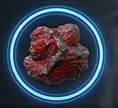</td></tr>
<tr><th colspan="2" style="text-align:center;">General</th></tr>
<tr><td><b>Rarity</b></td><td>legendary</td></tr>
<tr><td><b>Size</b></td><td>2</td></tr>
<tr><td><b>Stackable</b></td><td>Yes</td></tr>
<tr><td><b>Tradeable</b></td><td>Yes</td></tr>
<tr><th colspan="2" style="text-align:center;">Market</th></tr>
<tr><td><b>Base Value</b></td><td>800 cr</td></tr>
</table>

> Near-indestructible crystalline ore of unknown origin.

[View full page](ore_adamantite.md)

---

## Alien DNA Sample

<table>
<tr><th colspan="2" style="text-align:center;"><h3>Alien DNA Sample</h3></th></tr>
<tr><td colspan="2" style="text-align:center;">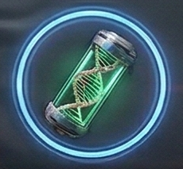</td></tr>
<tr><th colspan="2" style="text-align:center;">General</th></tr>
<tr><td><b>Rarity</b></td><td>exotic</td></tr>
<tr><td><b>Size</b></td><td>1</td></tr>
<tr><td><b>Stackable</b></td><td>Yes</td></tr>
<tr><td><b>Tradeable</b></td><td>Yes</td></tr>
<tr><th colspan="2" style="text-align:center;">Market</th></tr>
<tr><td><b>Base Value</b></td><td>300 cr</td></tr>
</table>

> Preserved genetic material from extraterrestrial life.

[View full page](bio_dna_sample.md)

---

## Alien Spores

<table>
<tr><th colspan="2" style="text-align:center;"><h3>Alien Spores</h3></th></tr>
<tr><td colspan="2" style="text-align:center;">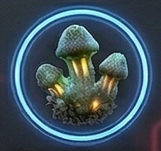</td></tr>
<tr><th colspan="2" style="text-align:center;">General</th></tr>
<tr><td><b>Rarity</b></td><td>uncommon</td></tr>
<tr><td><b>Size</b></td><td>1</td></tr>
<tr><td><b>Stackable</b></td><td>Yes</td></tr>
<tr><td><b>Tradeable</b></td><td>Yes</td></tr>
<tr><th colspan="2" style="text-align:center;">Market</th></tr>
<tr><td><b>Base Value</b></td><td>60 cr</td></tr>
</table>

> Dormant spores from unknown organisms. Handle in containment.

[View full page](bio_spores.md)

---

## Aluminum Ore

<table>
<tr><th colspan="2" style="text-align:center;"><h3>Aluminum Ore</h3></th></tr>
<tr><td colspan="2" style="text-align:center;">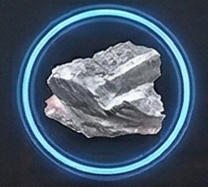</td></tr>
<tr><th colspan="2" style="text-align:center;">General</th></tr>
<tr><td><b>Rarity</b></td><td>common</td></tr>
<tr><td><b>Size</b></td><td>1</td></tr>
<tr><td><b>Stackable</b></td><td>Yes</td></tr>
<tr><td><b>Tradeable</b></td><td>Yes</td></tr>
<tr><th colspan="2" style="text-align:center;">Market</th></tr>
<tr><td><b>Base Value</b></td><td>6 cr</td></tr>
</table>

> Lightweight metal ore for basic hull construction.

[View full page](ore_aluminum.md)

---

## Americium Ore

<table>
<tr><th colspan="2" style="text-align:center;"><h3>Americium Ore</h3></th></tr>
<tr><td colspan="2" style="text-align:center;">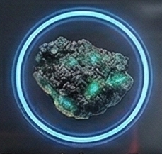</td></tr>
<tr><th colspan="2" style="text-align:center;">General</th></tr>
<tr><td><b>Rarity</b></td><td>exotic</td></tr>
<tr><td><b>Size</b></td><td>2</td></tr>
<tr><td><b>Stackable</b></td><td>Yes</td></tr>
<tr><td><b>Tradeable</b></td><td>Yes</td></tr>
<tr><th colspan="2" style="text-align:center;">Market</th></tr>
<tr><td><b>Base Value</b></td><td>400 cr</td></tr>
</table>

> Synthetic actinide recovered from ancient reactors.

[View full page](ore_americium.md)

---

## Ammonia Ice

<table>
<tr><th colspan="2" style="text-align:center;"><h3>Ammonia Ice</h3></th></tr>
<tr><td colspan="2" style="text-align:center;">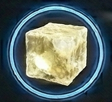</td></tr>
<tr><th colspan="2" style="text-align:center;">General</th></tr>
<tr><td><b>Rarity</b></td><td>common</td></tr>
<tr><td><b>Size</b></td><td>1</td></tr>
<tr><td><b>Stackable</b></td><td>Yes</td></tr>
<tr><td><b>Tradeable</b></td><td>Yes</td></tr>
<tr><th colspan="2" style="text-align:center;">Market</th></tr>
<tr><td><b>Base Value</b></td><td>14 cr</td></tr>
</table>

> Frozen ammonia used in industrial coolants and fertilizer.

[View full page](ore_ice_ammonia.md)

---

## Ancient Power Crystal

<table>
<tr><th colspan="2" style="text-align:center;"><h3>Ancient Power Crystal</h3></th></tr>
<tr><td colspan="2" style="text-align:center;"></td></tr>
<tr><th colspan="2" style="text-align:center;">General</th></tr>
<tr><td><b>Rarity</b></td><td>legendary</td></tr>
<tr><td><b>Size</b></td><td>2</td></tr>
<tr><td><b>Stackable</b></td><td>Yes</td></tr>
<tr><td><b>Tradeable</b></td><td>Yes</td></tr>
<tr><th colspan="2" style="text-align:center;">Market</th></tr>
<tr><td><b>Base Value</b></td><td>1,200 cr</td></tr>
</table>

> Crystalline energy source from a long-dead civilization. Still hums with power.

[View full page](ore_ancient_crystal.md)

---

## Antimatter Containment Cell

<table>
<tr><th colspan="2" style="text-align:center;"><h3>Antimatter Containment Cell</h3></th></tr>
<tr><td colspan="2" style="text-align:center;">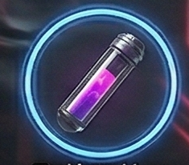</td></tr>
<tr><th colspan="2" style="text-align:center;">General</th></tr>
<tr><td><b>Rarity</b></td><td>legendary</td></tr>
<tr><td><b>Size</b></td><td>3</td></tr>
<tr><td><b>Stackable</b></td><td>Yes</td></tr>
<tr><td><b>Tradeable</b></td><td>Yes</td></tr>
<tr><th colspan="2" style="text-align:center;">Market</th></tr>
<tr><td><b>Base Value</b></td><td>800 cr</td></tr>
</table>

> Safely contained antimatter from Solarian research facilities.

[View full page](ore_antimatter.md)

---

## Argon Gas

<table>
<tr><th colspan="2" style="text-align:center;"><h3>Argon Gas</h3></th></tr>
<tr><td colspan="2" style="text-align:center;">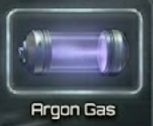</td></tr>
<tr><th colspan="2" style="text-align:center;">General</th></tr>
<tr><td><b>Rarity</b></td><td>common</td></tr>
<tr><td><b>Size</b></td><td>1</td></tr>
<tr><td><b>Stackable</b></td><td>Yes</td></tr>
<tr><td><b>Tradeable</b></td><td>Yes</td></tr>
<tr><th colspan="2" style="text-align:center;">Market</th></tr>
<tr><td><b>Base Value</b></td><td>12 cr</td></tr>
</table>

> Inert gas for shielding during welding and manufacturing.

[View full page](gas_argon.md)

---

## Bacterial Culture

<table>
<tr><th colspan="2" style="text-align:center;"><h3>Bacterial Culture</h3></th></tr>
<tr><td colspan="2" style="text-align:center;">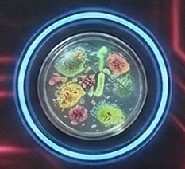</td></tr>
<tr><th colspan="2" style="text-align:center;">General</th></tr>
<tr><td><b>Rarity</b></td><td>common</td></tr>
<tr><td><b>Size</b></td><td>1</td></tr>
<tr><td><b>Stackable</b></td><td>Yes</td></tr>
<tr><td><b>Tradeable</b></td><td>Yes</td></tr>
<tr><th colspan="2" style="text-align:center;">Market</th></tr>
<tr><td><b>Base Value</b></td><td>30 cr</td></tr>
</table>

> Engineered bacteria for industrial bioprocessing.

[View full page](bio_bacterial_culture.md)

---

## Bioluminescent Polyps

<table>
<tr><th colspan="2" style="text-align:center;"><h3>Bioluminescent Polyps</h3></th></tr>
<tr><td colspan="2" style="text-align:center;">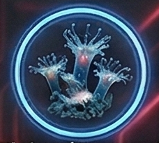</td></tr>
<tr><th colspan="2" style="text-align:center;">General</th></tr>
<tr><td><b>Rarity</b></td><td>uncommon</td></tr>
<tr><td><b>Size</b></td><td>1</td></tr>
<tr><td><b>Stackable</b></td><td>Yes</td></tr>
<tr><td><b>Tradeable</b></td><td>Yes</td></tr>
<tr><th colspan="2" style="text-align:center;">Market</th></tr>
<tr><td><b>Base Value</b></td><td>40 cr</td></tr>
</table>

> Light-emitting xenobiological organisms harvested from reef nebulae.

[View full page](bio_bioluminescent.md)

---

## Californium Ore

<table>
<tr><th colspan="2" style="text-align:center;"><h3>Californium Ore</h3></th></tr>
<tr><td colspan="2" style="text-align:center;">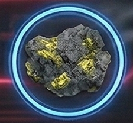</td></tr>
<tr><th colspan="2" style="text-align:center;">General</th></tr>
<tr><td><b>Rarity</b></td><td>legendary</td></tr>
<tr><td><b>Size</b></td><td>2</td></tr>
<tr><td><b>Stackable</b></td><td>Yes</td></tr>
<tr><td><b>Tradeable</b></td><td>Yes</td></tr>
<tr><th colspan="2" style="text-align:center;">Market</th></tr>
<tr><td><b>Base Value</b></td><td>800 cr</td></tr>
</table>

> Ultra-rare element for neutron-based scanners and weapons.

[View full page](ore_californium.md)

---

## Carbon Dioxide Ice

<table>
<tr><th colspan="2" style="text-align:center;"><h3>Carbon Dioxide Ice</h3></th></tr>
<tr><td colspan="2" style="text-align:center;">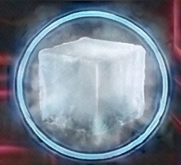</td></tr>
<tr><th colspan="2" style="text-align:center;">General</th></tr>
<tr><td><b>Rarity</b></td><td>common</td></tr>
<tr><td><b>Size</b></td><td>1</td></tr>
<tr><td><b>Stackable</b></td><td>Yes</td></tr>
<tr><td><b>Tradeable</b></td><td>Yes</td></tr>
<tr><th colspan="2" style="text-align:center;">Market</th></tr>
<tr><td><b>Base Value</b></td><td>10 cr</td></tr>
</table>

> Dry ice used in atmospheric processing and refrigeration.

[View full page](ore_ice_co2.md)

---

## Carbon Ore

<table>
<tr><th colspan="2" style="text-align:center;"><h3>Carbon Ore</h3></th></tr>
<tr><td colspan="2" style="text-align:center;">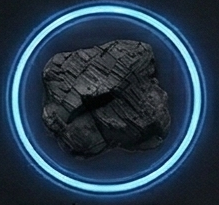</td></tr>
<tr><th colspan="2" style="text-align:center;">General</th></tr>
<tr><td><b>Rarity</b></td><td>common</td></tr>
<tr><td><b>Size</b></td><td>1</td></tr>
<tr><td><b>Stackable</b></td><td>Yes</td></tr>
<tr><td><b>Tradeable</b></td><td>Yes</td></tr>
<tr><th colspan="2" style="text-align:center;">Market</th></tr>
<tr><td><b>Base Value</b></td><td>4 cr</td></tr>
</table>

> Versatile element used in composites and filtration systems.

[View full page](ore_carbon.md)

---

## Chlorine Gas

<table>
<tr><th colspan="2" style="text-align:center;"><h3>Chlorine Gas</h3></th></tr>
<tr><td colspan="2" style="text-align:center;">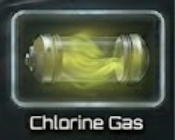</td></tr>
<tr><th colspan="2" style="text-align:center;">General</th></tr>
<tr><td><b>Rarity</b></td><td>uncommon</td></tr>
<tr><td><b>Size</b></td><td>1</td></tr>
<tr><td><b>Stackable</b></td><td>Yes</td></tr>
<tr><td><b>Tradeable</b></td><td>Yes</td></tr>
<tr><th colspan="2" style="text-align:center;">Market</th></tr>
<tr><td><b>Base Value</b></td><td>25 cr</td></tr>
</table>

> Toxic gas used in chemical synthesis and weapons.

[View full page](gas_chlorine.md)

---

## Chromium Ore

<table>
<tr><th colspan="2" style="text-align:center;"><h3>Chromium Ore</h3></th></tr>
<tr><td colspan="2" style="text-align:center;">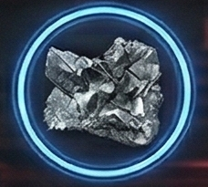</td></tr>
<tr><th colspan="2" style="text-align:center;">General</th></tr>
<tr><td><b>Rarity</b></td><td>uncommon</td></tr>
<tr><td><b>Size</b></td><td>1</td></tr>
<tr><td><b>Stackable</b></td><td>Yes</td></tr>
<tr><td><b>Tradeable</b></td><td>Yes</td></tr>
<tr><th colspan="2" style="text-align:center;">Market</th></tr>
<tr><td><b>Base Value</b></td><td>20 cr</td></tr>
</table>

> Essential for creating stainless alloys and hardening steel.

[View full page](ore_chromium.md)

---

## Cobalt Ore

<table>
<tr><th colspan="2" style="text-align:center;"><h3>Cobalt Ore</h3></th></tr>
<tr><td colspan="2" style="text-align:center;">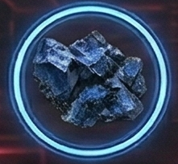</td></tr>
<tr><th colspan="2" style="text-align:center;">General</th></tr>
<tr><td><b>Rarity</b></td><td>uncommon</td></tr>
<tr><td><b>Size</b></td><td>1</td></tr>
<tr><td><b>Stackable</b></td><td>Yes</td></tr>
<tr><td><b>Tradeable</b></td><td>Yes</td></tr>
<tr><th colspan="2" style="text-align:center;">Market</th></tr>
<tr><td><b>Base Value</b></td><td>22 cr</td></tr>
</table>

> Heat-resistant ore used in engine components.

[View full page](ore_cobalt.md)

---

## Compressed Hydrogen

<table>
<tr><th colspan="2" style="text-align:center;"><h3>Compressed Hydrogen</h3></th></tr>
<tr><td colspan="2" style="text-align:center;">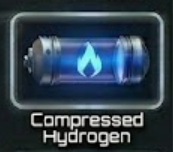</td></tr>
<tr><th colspan="2" style="text-align:center;">General</th></tr>
<tr><td><b>Rarity</b></td><td>common</td></tr>
<tr><td><b>Size</b></td><td>1</td></tr>
<tr><td><b>Stackable</b></td><td>Yes</td></tr>
<tr><td><b>Tradeable</b></td><td>Yes</td></tr>
<tr><th colspan="2" style="text-align:center;">Market</th></tr>
<tr><td><b>Base Value</b></td><td>8 cr</td></tr>
</table>

> Basic fuel source harvested from gas giants and nebulae.

[View full page](gas_hydrogen.md)

---

## Copper Ore

<table>
<tr><th colspan="2" style="text-align:center;"><h3>Copper Ore</h3></th></tr>
<tr><td colspan="2" style="text-align:center;">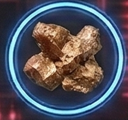</td></tr>
<tr><th colspan="2" style="text-align:center;">General</th></tr>
<tr><td><b>Rarity</b></td><td>common</td></tr>
<tr><td><b>Size</b></td><td>1</td></tr>
<tr><td><b>Stackable</b></td><td>Yes</td></tr>
<tr><td><b>Tradeable</b></td><td>Yes</td></tr>
<tr><th colspan="2" style="text-align:center;">Market</th></tr>
<tr><td><b>Base Value</b></td><td>8 cr</td></tr>
</table>

> Conductive copper ore, essential for electronics.

[View full page](ore_copper.md)

---

## Dark Matter Residue

<table>
<tr><th colspan="2" style="text-align:center;"><h3>Dark Matter Residue</h3></th></tr>
<tr><td colspan="2" style="text-align:center;">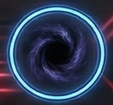</td></tr>
<tr><th colspan="2" style="text-align:center;">General</th></tr>
<tr><td><b>Rarity</b></td><td>legendary</td></tr>
<tr><td><b>Size</b></td><td>3</td></tr>
<tr><td><b>Stackable</b></td><td>Yes</td></tr>
<tr><td><b>Tradeable</b></td><td>Yes</td></tr>
<tr><th colspan="2" style="text-align:center;">Market</th></tr>
<tr><td><b>Base Value</b></td><td>700 cr</td></tr>
</table>

> Condensed dark matter found only in the deepest reaches of the Outer Rim.

[View full page](ore_outerrim_dark.md)

---

## Darksteel Ore

<table>
<tr><th colspan="2" style="text-align:center;"><h3>Darksteel Ore</h3></th></tr>
<tr><td colspan="2" style="text-align:center;">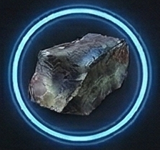</td></tr>
<tr><th colspan="2" style="text-align:center;">General</th></tr>
<tr><td><b>Rarity</b></td><td>exotic</td></tr>
<tr><td><b>Size</b></td><td>2</td></tr>
<tr><td><b>Stackable</b></td><td>Yes</td></tr>
<tr><td><b>Tradeable</b></td><td>Yes</td></tr>
<tr><th colspan="2" style="text-align:center;">Market</th></tr>
<tr><td><b>Base Value</b></td><td>350 cr</td></tr>
</table>

> Incredibly dense metal found only in black hole accretion disks near Crimson space.

[View full page](ore_darksteel.md)

---

## Deuterium Ice

<table>
<tr><th colspan="2" style="text-align:center;"><h3>Deuterium Ice</h3></th></tr>
<tr><td colspan="2" style="text-align:center;">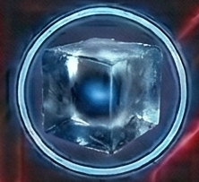</td></tr>
<tr><th colspan="2" style="text-align:center;">General</th></tr>
<tr><td><b>Rarity</b></td><td>rare</td></tr>
<tr><td><b>Size</b></td><td>2</td></tr>
<tr><td><b>Stackable</b></td><td>Yes</td></tr>
<tr><td><b>Tradeable</b></td><td>Yes</td></tr>
<tr><th colspan="2" style="text-align:center;">Market</th></tr>
<tr><td><b>Base Value</b></td><td>120 cr</td></tr>
</table>

> Heavy water ice for advanced fusion reactors.

[View full page](ore_ice_deuterium.md)

---

## Dimensional Shards

<table>
<tr><th colspan="2" style="text-align:center;"><h3>Dimensional Shards</h3></th></tr>
<tr><td colspan="2" style="text-align:center;"></td></tr>
<tr><th colspan="2" style="text-align:center;">General</th></tr>
<tr><td><b>Rarity</b></td><td>legendary</td></tr>
<tr><td><b>Size</b></td><td>2</td></tr>
<tr><td><b>Stackable</b></td><td>Yes</td></tr>
<tr><td><b>Tradeable</b></td><td>Yes</td></tr>
<tr><th colspan="2" style="text-align:center;">Market</th></tr>
<tr><td><b>Base Value</b></td><td>1,800 cr</td></tr>
</table>

> Fragments of matter from parallel dimensions. Highly unstable.

[View full page](ore_dimensional_shards.md)

---

## Elder Bone

<table>
<tr><th colspan="2" style="text-align:center;"><h3>Elder Bone</h3></th></tr>
<tr><td colspan="2" style="text-align:center;">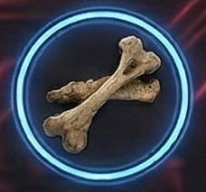</td></tr>
<tr><th colspan="2" style="text-align:center;">General</th></tr>
<tr><td><b>Rarity</b></td><td>exotic</td></tr>
<tr><td><b>Size</b></td><td>3</td></tr>
<tr><td><b>Stackable</b></td><td>Yes</td></tr>
<tr><td><b>Tradeable</b></td><td>Yes</td></tr>
<tr><th colspan="2" style="text-align:center;">Market</th></tr>
<tr><td><b>Base Value</b></td><td>600 cr</td></tr>
</table>

> Fossilized remains of enormous ancient creatures. Surprisingly durable.

[View full page](ore_elder_bone.md)

---

## Energy Crystal

<table>
<tr><th colspan="2" style="text-align:center;"><h3>Energy Crystal</h3></th></tr>
<tr><td colspan="2" style="text-align:center;"></td></tr>
<tr><th colspan="2" style="text-align:center;">General</th></tr>
<tr><td><b>Rarity</b></td><td>rare</td></tr>
<tr><td><b>Size</b></td><td>1</td></tr>
<tr><td><b>Stackable</b></td><td>Yes</td></tr>
<tr><td><b>Tradeable</b></td><td>Yes</td></tr>
<tr><th colspan="2" style="text-align:center;">Market</th></tr>
<tr><td><b>Base Value</b></td><td>75 cr</td></tr>
</table>

> Naturally occurring crystals that store and amplify energy.

[View full page](ore_crystal.md)

---

## Enzyme Cluster

<table>
<tr><th colspan="2" style="text-align:center;"><h3>Enzyme Cluster</h3></th></tr>
<tr><td colspan="2" style="text-align:center;"></td></tr>
<tr><th colspan="2" style="text-align:center;">General</th></tr>
<tr><td><b>Rarity</b></td><td>rare</td></tr>
<tr><td><b>Size</b></td><td>1</td></tr>
<tr><td><b>Stackable</b></td><td>Yes</td></tr>
<tr><td><b>Tradeable</b></td><td>Yes</td></tr>
<tr><th colspan="2" style="text-align:center;">Market</th></tr>
<tr><td><b>Base Value</b></td><td>75 cr</td></tr>
</table>

> Biological catalysts for advanced manufacturing.

[View full page](bio_enzyme_cluster.md)

---

## Exotic Matter

<table>
<tr><th colspan="2" style="text-align:center;"><h3>Exotic Matter</h3></th></tr>
<tr><td colspan="2" style="text-align:center;"></td></tr>
<tr><th colspan="2" style="text-align:center;">General</th></tr>
<tr><td><b>Rarity</b></td><td>exotic</td></tr>
<tr><td><b>Size</b></td><td>2</td></tr>
<tr><td><b>Stackable</b></td><td>Yes</td></tr>
<tr><td><b>Tradeable</b></td><td>Yes</td></tr>
<tr><th colspan="2" style="text-align:center;">Market</th></tr>
<tr><td><b>Base Value</b></td><td>250 cr</td></tr>
</table>

> Strange matter with properties that defy conventional physics. Found only in Voidborn space.

[View full page](ore_exotic.md)

---

## Fluorine Gas

<table>
<tr><th colspan="2" style="text-align:center;"><h3>Fluorine Gas</h3></th></tr>
<tr><td colspan="2" style="text-align:center;"></td></tr>
<tr><th colspan="2" style="text-align:center;">General</th></tr>
<tr><td><b>Rarity</b></td><td>rare</td></tr>
<tr><td><b>Size</b></td><td>1</td></tr>
<tr><td><b>Stackable</b></td><td>Yes</td></tr>
<tr><td><b>Tradeable</b></td><td>Yes</td></tr>
<tr><th colspan="2" style="text-align:center;">Market</th></tr>
<tr><td><b>Base Value</b></td><td>45 cr</td></tr>
</table>

> Highly reactive gas for chemical etching and processing.

[View full page](gas_fluorine.md)

---

## Fungal Extract

<table>
<tr><th colspan="2" style="text-align:center;"><h3>Fungal Extract</h3></th></tr>
<tr><td colspan="2" style="text-align:center;"></td></tr>
<tr><th colspan="2" style="text-align:center;">General</th></tr>
<tr><td><b>Rarity</b></td><td>uncommon</td></tr>
<tr><td><b>Size</b></td><td>1</td></tr>
<tr><td><b>Stackable</b></td><td>Yes</td></tr>
<tr><td><b>Tradeable</b></td><td>Yes</td></tr>
<tr><th colspan="2" style="text-align:center;">Market</th></tr>
<tr><td><b>Base Value</b></td><td>35 cr</td></tr>
</table>

> Concentrated extracts from xenofungal colonies.

[View full page](bio_fungal_extract.md)

---

## Fury Crystal

<table>
<tr><th colspan="2" style="text-align:center;"><h3>Fury Crystal</h3></th></tr>
<tr><td colspan="2" style="text-align:center;"></td></tr>
<tr><th colspan="2" style="text-align:center;">General</th></tr>
<tr><td><b>Rarity</b></td><td>exotic</td></tr>
<tr><td><b>Size</b></td><td>2</td></tr>
<tr><td><b>Stackable</b></td><td>Yes</td></tr>
<tr><td><b>Tradeable</b></td><td>Yes</td></tr>
<tr><th colspan="2" style="text-align:center;">Market</th></tr>
<tr><td><b>Base Value</b></td><td>320 cr</td></tr>
</table>

> Superheated crystals from Crimson volcanic worlds, pulsing with thermal energy.

[View full page](ore_crimson_fury.md)

---

## Gold Ore

<table>
<tr><th colspan="2" style="text-align:center;"><h3>Gold Ore</h3></th></tr>
<tr><td colspan="2" style="text-align:center;"></td></tr>
<tr><th colspan="2" style="text-align:center;">General</th></tr>
<tr><td><b>Rarity</b></td><td>uncommon</td></tr>
<tr><td><b>Size</b></td><td>1</td></tr>
<tr><td><b>Stackable</b></td><td>Yes</td></tr>
<tr><td><b>Tradeable</b></td><td>Yes</td></tr>
<tr><th colspan="2" style="text-align:center;">Market</th></tr>
<tr><td><b>Base Value</b></td><td>45 cr</td></tr>
</table>

> Highly conductive precious metal for advanced electronics.

[View full page](ore_gold.md)

---

## Helium Ice

<table>
<tr><th colspan="2" style="text-align:center;"><h3>Helium Ice</h3></th></tr>
<tr><td colspan="2" style="text-align:center;"></td></tr>
<tr><th colspan="2" style="text-align:center;">General</th></tr>
<tr><td><b>Rarity</b></td><td>rare</td></tr>
<tr><td><b>Size</b></td><td>2</td></tr>
<tr><td><b>Stackable</b></td><td>Yes</td></tr>
<tr><td><b>Tradeable</b></td><td>Yes</td></tr>
<tr><th colspan="2" style="text-align:center;">Market</th></tr>
<tr><td><b>Base Value</b></td><td>85 cr</td></tr>
</table>

> Frozen helium-3 from gas giant atmospheres. Premium fusion fuel.

[View full page](ore_ice_helium.md)

---

## Ion Gas

<table>
<tr><th colspan="2" style="text-align:center;"><h3>Ion Gas</h3></th></tr>
<tr><td colspan="2" style="text-align:center;">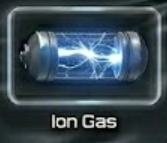</td></tr>
<tr><th colspan="2" style="text-align:center;">General</th></tr>
<tr><td><b>Rarity</b></td><td>uncommon</td></tr>
<tr><td><b>Size</b></td><td>1</td></tr>
<tr><td><b>Stackable</b></td><td>Yes</td></tr>
<tr><td><b>Tradeable</b></td><td>Yes</td></tr>
<tr><th colspan="2" style="text-align:center;">Market</th></tr>
<tr><td><b>Base Value</b></td><td>35 cr</td></tr>
</table>

> Highly charged gas for ion propulsion systems.

[View full page](gas_ion.md)

---

## Iridium Ore

<table>
<tr><th colspan="2" style="text-align:center;"><h3>Iridium Ore</h3></th></tr>
<tr><td colspan="2" style="text-align:center;"></td></tr>
<tr><th colspan="2" style="text-align:center;">General</th></tr>
<tr><td><b>Rarity</b></td><td>rare</td></tr>
<tr><td><b>Size</b></td><td>1</td></tr>
<tr><td><b>Stackable</b></td><td>Yes</td></tr>
<tr><td><b>Tradeable</b></td><td>Yes</td></tr>
<tr><th colspan="2" style="text-align:center;">Market</th></tr>
<tr><td><b>Base Value</b></td><td>90 cr</td></tr>
</table>

> Dense, corrosion-proof metal for high-stress components.

[View full page](ore_iridium.md)

---

## Iron Ore

<table>
<tr><th colspan="2" style="text-align:center;"><h3>Iron Ore</h3></th></tr>
<tr><td colspan="2" style="text-align:center;"></td></tr>
<tr><th colspan="2" style="text-align:center;">General</th></tr>
<tr><td><b>Rarity</b></td><td>common</td></tr>
<tr><td><b>Size</b></td><td>1</td></tr>
<tr><td><b>Stackable</b></td><td>Yes</td></tr>
<tr><td><b>Tradeable</b></td><td>Yes</td></tr>
<tr><th colspan="2" style="text-align:center;">Market</th></tr>
<tr><td><b>Base Value</b></td><td>5 cr</td></tr>
</table>

> Common ferrous ore, the backbone of basic construction.

[View full page](ore_iron.md)

---

## Krypton Gas

<table>
<tr><th colspan="2" style="text-align:center;"><h3>Krypton Gas</h3></th></tr>
<tr><td colspan="2" style="text-align:center;"></td></tr>
<tr><th colspan="2" style="text-align:center;">General</th></tr>
<tr><td><b>Rarity</b></td><td>rare</td></tr>
<tr><td><b>Size</b></td><td>1</td></tr>
<tr><td><b>Stackable</b></td><td>Yes</td></tr>
<tr><td><b>Tradeable</b></td><td>Yes</td></tr>
<tr><th colspan="2" style="text-align:center;">Market</th></tr>
<tr><td><b>Base Value</b></td><td>50 cr</td></tr>
</table>

> Rare noble gas for high-efficiency lighting systems.

[View full page](gas_krypton.md)

---

## Lead Ore

<table>
<tr><th colspan="2" style="text-align:center;"><h3>Lead Ore</h3></th></tr>
<tr><td colspan="2" style="text-align:center;"></td></tr>
<tr><th colspan="2" style="text-align:center;">General</th></tr>
<tr><td><b>Rarity</b></td><td>common</td></tr>
<tr><td><b>Size</b></td><td>2</td></tr>
<tr><td><b>Stackable</b></td><td>Yes</td></tr>
<tr><td><b>Tradeable</b></td><td>Yes</td></tr>
<tr><th colspan="2" style="text-align:center;">Market</th></tr>
<tr><td><b>Base Value</b></td><td>5 cr</td></tr>
</table>

> Dense metal used for radiation shielding and ballast.

[View full page](ore_lead.md)

---

## Legacy Ore

<table>
<tr><th colspan="2" style="text-align:center;"><h3>Legacy Ore</h3></th></tr>
<tr><td colspan="2" style="text-align:center;"></td></tr>
<tr><th colspan="2" style="text-align:center;">General</th></tr>
<tr><td><b>Rarity</b></td><td>exotic</td></tr>
<tr><td><b>Size</b></td><td>2</td></tr>
<tr><td><b>Stackable</b></td><td>Yes</td></tr>
<tr><td><b>Tradeable</b></td><td>Yes</td></tr>
<tr><th colspan="2" style="text-align:center;">Market</th></tr>
<tr><td><b>Base Value</b></td><td>450 cr</td></tr>
</table>

> Pre-spacefaring Earth artifacts fused with asteroid material over millennia.

[View full page](ore_solarian_legacy.md)

---

## Lithium Ore

<table>
<tr><th colspan="2" style="text-align:center;"><h3>Lithium Ore</h3></th></tr>
<tr><td colspan="2" style="text-align:center;"></td></tr>
<tr><th colspan="2" style="text-align:center;">General</th></tr>
<tr><td><b>Rarity</b></td><td>uncommon</td></tr>
<tr><td><b>Size</b></td><td>1</td></tr>
<tr><td><b>Stackable</b></td><td>Yes</td></tr>
<tr><td><b>Tradeable</b></td><td>Yes</td></tr>
<tr><th colspan="2" style="text-align:center;">Market</th></tr>
<tr><td><b>Base Value</b></td><td>18 cr</td></tr>
</table>

> Essential for energy storage systems and batteries.

[View full page](ore_lithium.md)

---

## Manganese Ore

<table>
<tr><th colspan="2" style="text-align:center;"><h3>Manganese Ore</h3></th></tr>
<tr><td colspan="2" style="text-align:center;"></td></tr>
<tr><th colspan="2" style="text-align:center;">General</th></tr>
<tr><td><b>Rarity</b></td><td>uncommon</td></tr>
<tr><td><b>Size</b></td><td>1</td></tr>
<tr><td><b>Stackable</b></td><td>Yes</td></tr>
<tr><td><b>Tradeable</b></td><td>Yes</td></tr>
<tr><th colspan="2" style="text-align:center;">Market</th></tr>
<tr><td><b>Base Value</b></td><td>15 cr</td></tr>
</table>

> Strengthening agent for steel and aluminum alloys.

[View full page](ore_manganese.md)

---

## Methane Ice

<table>
<tr><th colspan="2" style="text-align:center;"><h3>Methane Ice</h3></th></tr>
<tr><td colspan="2" style="text-align:center;">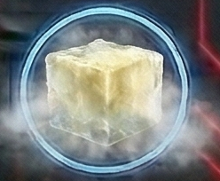</td></tr>
<tr><th colspan="2" style="text-align:center;">General</th></tr>
<tr><td><b>Rarity</b></td><td>common</td></tr>
<tr><td><b>Size</b></td><td>1</td></tr>
<tr><td><b>Stackable</b></td><td>Yes</td></tr>
<tr><td><b>Tradeable</b></td><td>Yes</td></tr>
<tr><th colspan="2" style="text-align:center;">Market</th></tr>
<tr><td><b>Base Value</b></td><td>18 cr</td></tr>
</table>

> Frozen methane for chemical processing and fuel synthesis.

[View full page](ore_ice_methane.md)

---

## Nebula Gas

<table>
<tr><th colspan="2" style="text-align:center;"><h3>Nebula Gas</h3></th></tr>
<tr><td colspan="2" style="text-align:center;">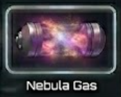</td></tr>
<tr><th colspan="2" style="text-align:center;">General</th></tr>
<tr><td><b>Rarity</b></td><td>uncommon</td></tr>
<tr><td><b>Size</b></td><td>2</td></tr>
<tr><td><b>Stackable</b></td><td>Yes</td></tr>
<tr><td><b>Tradeable</b></td><td>Yes</td></tr>
<tr><th colspan="2" style="text-align:center;">Market</th></tr>
<tr><td><b>Base Value</b></td><td>55 cr</td></tr>
</table>

> Complex mixture of exotic compounds found only in nebulae.

[View full page](gas_nebula.md)

---

## Nebulium

<table>
<tr><th colspan="2" style="text-align:center;"><h3>Nebulium</h3></th></tr>
<tr><td colspan="2" style="text-align:center;"></td></tr>
<tr><th colspan="2" style="text-align:center;">General</th></tr>
<tr><td><b>Rarity</b></td><td>exotic</td></tr>
<tr><td><b>Size</b></td><td>1</td></tr>
<tr><td><b>Stackable</b></td><td>Yes</td></tr>
<tr><td><b>Tradeable</b></td><td>Yes</td></tr>
<tr><th colspan="2" style="text-align:center;">Market</th></tr>
<tr><td><b>Base Value</b></td><td>280 cr</td></tr>
</table>

> Crystallized energy from the heart of nebulae in Nebula Federation territory.

[View full page](ore_nebulium.md)

---

## Neodymium Ore

<table>
<tr><th colspan="2" style="text-align:center;"><h3>Neodymium Ore</h3></th></tr>
<tr><td colspan="2" style="text-align:center;"></td></tr>
<tr><th colspan="2" style="text-align:center;">General</th></tr>
<tr><td><b>Rarity</b></td><td>rare</td></tr>
<tr><td><b>Size</b></td><td>1</td></tr>
<tr><td><b>Stackable</b></td><td>Yes</td></tr>
<tr><td><b>Tradeable</b></td><td>Yes</td></tr>
<tr><th colspan="2" style="text-align:center;">Market</th></tr>
<tr><td><b>Base Value</b></td><td>70 cr</td></tr>
</table>

> Rare earth element for creating powerful magnets.

[View full page](ore_neodymium.md)

---

## Neon Gas

<table>
<tr><th colspan="2" style="text-align:center;"><h3>Neon Gas</h3></th></tr>
<tr><td colspan="2" style="text-align:center;">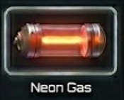</td></tr>
<tr><th colspan="2" style="text-align:center;">General</th></tr>
<tr><td><b>Rarity</b></td><td>common</td></tr>
<tr><td><b>Size</b></td><td>1</td></tr>
<tr><td><b>Stackable</b></td><td>Yes</td></tr>
<tr><td><b>Tradeable</b></td><td>Yes</td></tr>
<tr><th colspan="2" style="text-align:center;">Market</th></tr>
<tr><td><b>Base Value</b></td><td>15 cr</td></tr>
</table>

> Bright noble gas for signage and laser medium.

[View full page](gas_neon.md)

---

## Neural Tissue Sample

<table>
<tr><th colspan="2" style="text-align:center;"><h3>Neural Tissue Sample</h3></th></tr>
<tr><td colspan="2" style="text-align:center;"></td></tr>
<tr><th colspan="2" style="text-align:center;">General</th></tr>
<tr><td><b>Rarity</b></td><td>rare</td></tr>
<tr><td><b>Size</b></td><td>1</td></tr>
<tr><td><b>Stackable</b></td><td>Yes</td></tr>
<tr><td><b>Tradeable</b></td><td>Yes</td></tr>
<tr><th colspan="2" style="text-align:center;">Market</th></tr>
<tr><td><b>Base Value</b></td><td>150 cr</td></tr>
</table>

> Preserved neural matter from space-faring organisms.

[View full page](bio_neural_tissue.md)

---

## Nickel Ore

<table>
<tr><th colspan="2" style="text-align:center;"><h3>Nickel Ore</h3></th></tr>
<tr><td colspan="2" style="text-align:center;"></td></tr>
<tr><th colspan="2" style="text-align:center;">General</th></tr>
<tr><td><b>Rarity</b></td><td>common</td></tr>
<tr><td><b>Size</b></td><td>1</td></tr>
<tr><td><b>Stackable</b></td><td>Yes</td></tr>
<tr><td><b>Tradeable</b></td><td>Yes</td></tr>
<tr><th colspan="2" style="text-align:center;">Market</th></tr>
<tr><td><b>Base Value</b></td><td>7 cr</td></tr>
</table>

> Corrosion-resistant ore used in alloy production.

[View full page](ore_nickel.md)

---

## Nitrogen Ice

<table>
<tr><th colspan="2" style="text-align:center;"><h3>Nitrogen Ice</h3></th></tr>
<tr><td colspan="2" style="text-align:center;">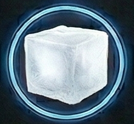</td></tr>
<tr><th colspan="2" style="text-align:center;">General</th></tr>
<tr><td><b>Rarity</b></td><td>common</td></tr>
<tr><td><b>Size</b></td><td>1</td></tr>
<tr><td><b>Stackable</b></td><td>Yes</td></tr>
<tr><td><b>Tradeable</b></td><td>Yes</td></tr>
<tr><th colspan="2" style="text-align:center;">Market</th></tr>
<tr><td><b>Base Value</b></td><td>15 cr</td></tr>
</table>

> Frozen nitrogen used in cooling systems and life support.

[View full page](ore_ice_nitrogen.md)

---

## Null Matter

<table>
<tr><th colspan="2" style="text-align:center;"><h3>Null Matter</h3></th></tr>
<tr><td colspan="2" style="text-align:center;"></td></tr>
<tr><th colspan="2" style="text-align:center;">General</th></tr>
<tr><td><b>Rarity</b></td><td>exotic</td></tr>
<tr><td><b>Size</b></td><td>2</td></tr>
<tr><td><b>Stackable</b></td><td>Yes</td></tr>
<tr><td><b>Tradeable</b></td><td>Yes</td></tr>
<tr><th colspan="2" style="text-align:center;">Market</th></tr>
<tr><td><b>Base Value</b></td><td>450 cr</td></tr>
</table>

> Material that seems to absorb energy and light. Unique to Voidborn anomaly zones.

[View full page](ore_voidborn_null.md)

---

## Organic Compound

<table>
<tr><th colspan="2" style="text-align:center;"><h3>Organic Compound</h3></th></tr>
<tr><td colspan="2" style="text-align:center;"></td></tr>
<tr><th colspan="2" style="text-align:center;">General</th></tr>
<tr><td><b>Rarity</b></td><td>uncommon</td></tr>
<tr><td><b>Size</b></td><td>1</td></tr>
<tr><td><b>Stackable</b></td><td>Yes</td></tr>
<tr><td><b>Tradeable</b></td><td>Yes</td></tr>
<tr><th colspan="2" style="text-align:center;">Market</th></tr>
<tr><td><b>Base Value</b></td><td>45 cr</td></tr>
</table>

> Complex carbon-based molecules harvested from life-bearing worlds.

[View full page](bio_organic_compound.md)

---

## Osmium Ore

<table>
<tr><th colspan="2" style="text-align:center;"><h3>Osmium Ore</h3></th></tr>
<tr><td colspan="2" style="text-align:center;"></td></tr>
<tr><th colspan="2" style="text-align:center;">General</th></tr>
<tr><td><b>Rarity</b></td><td>rare</td></tr>
<tr><td><b>Size</b></td><td>2</td></tr>
<tr><td><b>Stackable</b></td><td>Yes</td></tr>
<tr><td><b>Tradeable</b></td><td>Yes</td></tr>
<tr><th colspan="2" style="text-align:center;">Market</th></tr>
<tr><td><b>Base Value</b></td><td>100 cr</td></tr>
</table>

> The densest naturally occurring element, used in specialized armor.

[View full page](ore_osmium.md)

---

## Oxygen Ice

<table>
<tr><th colspan="2" style="text-align:center;"><h3>Oxygen Ice</h3></th></tr>
<tr><td colspan="2" style="text-align:center;">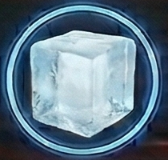</td></tr>
<tr><th colspan="2" style="text-align:center;">General</th></tr>
<tr><td><b>Rarity</b></td><td>uncommon</td></tr>
<tr><td><b>Size</b></td><td>1</td></tr>
<tr><td><b>Stackable</b></td><td>Yes</td></tr>
<tr><td><b>Tradeable</b></td><td>Yes</td></tr>
<tr><th colspan="2" style="text-align:center;">Market</th></tr>
<tr><td><b>Base Value</b></td><td>20 cr</td></tr>
</table>

> Solid oxygen for emergency life support reserves.

[View full page](ore_ice_oxygen.md)

---

## Palladium Ore

<table>
<tr><th colspan="2" style="text-align:center;"><h3>Palladium Ore</h3></th></tr>
<tr><td colspan="2" style="text-align:center;"></td></tr>
<tr><th colspan="2" style="text-align:center;">General</th></tr>
<tr><td><b>Rarity</b></td><td>rare</td></tr>
<tr><td><b>Size</b></td><td>1</td></tr>
<tr><td><b>Stackable</b></td><td>Yes</td></tr>
<tr><td><b>Tradeable</b></td><td>Yes</td></tr>
<tr><th colspan="2" style="text-align:center;">Market</th></tr>
<tr><td><b>Base Value</b></td><td>80 cr</td></tr>
</table>

> Rare earth element crucial for shield emitter arrays.

[View full page](ore_palladium.md)

---

## Phase Crystal

<table>
<tr><th colspan="2" style="text-align:center;"><h3>Phase Crystal</h3></th></tr>
<tr><td colspan="2" style="text-align:center;"></td></tr>
<tr><th colspan="2" style="text-align:center;">General</th></tr>
<tr><td><b>Rarity</b></td><td>legendary</td></tr>
<tr><td><b>Size</b></td><td>2</td></tr>
<tr><td><b>Stackable</b></td><td>Yes</td></tr>
<tr><td><b>Tradeable</b></td><td>Yes</td></tr>
<tr><th colspan="2" style="text-align:center;">Market</th></tr>
<tr><td><b>Base Value</b></td><td>500 cr</td></tr>
</table>

> Exists partially out of phase with normal space-time. Found only in Outer Rim exploration zones.

[View full page](ore_phase_crystal.md)

---

## Pheromone Compound

<table>
<tr><th colspan="2" style="text-align:center;"><h3>Pheromone Compound</h3></th></tr>
<tr><td colspan="2" style="text-align:center;"></td></tr>
<tr><th colspan="2" style="text-align:center;">General</th></tr>
<tr><td><b>Rarity</b></td><td>exotic</td></tr>
<tr><td><b>Size</b></td><td>1</td></tr>
<tr><td><b>Stackable</b></td><td>Yes</td></tr>
<tr><td><b>Tradeable</b></td><td>Yes</td></tr>
<tr><th colspan="2" style="text-align:center;">Market</th></tr>
<tr><td><b>Base Value</b></td><td>200 cr</td></tr>
</table>

> Chemical signals extracted from hive-mind species.

[View full page](bio_pheromone.md)

---

## Plasma Gas

<table>
<tr><th colspan="2" style="text-align:center;"><h3>Plasma Gas</h3></th></tr>
<tr><td colspan="2" style="text-align:center;">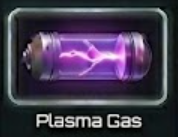</td></tr>
<tr><th colspan="2" style="text-align:center;">General</th></tr>
<tr><td><b>Rarity</b></td><td>uncommon</td></tr>
<tr><td><b>Size</b></td><td>2</td></tr>
<tr><td><b>Stackable</b></td><td>Yes</td></tr>
<tr><td><b>Tradeable</b></td><td>Yes</td></tr>
<tr><th colspan="2" style="text-align:center;">Market</th></tr>
<tr><td><b>Base Value</b></td><td>65 cr</td></tr>
</table>

> Superheated ionized gas captured from stellar coronas.

[View full page](gas_plasma.md)

---

## Plasma Residue

<table>
<tr><th colspan="2" style="text-align:center;"><h3>Plasma Residue</h3></th></tr>
<tr><td colspan="2" style="text-align:center;"></td></tr>
<tr><th colspan="2" style="text-align:center;">General</th></tr>
<tr><td><b>Rarity</b></td><td>exotic</td></tr>
<tr><td><b>Size</b></td><td>2</td></tr>
<tr><td><b>Stackable</b></td><td>Yes</td></tr>
<tr><td><b>Tradeable</b></td><td>Yes</td></tr>
<tr><th colspan="2" style="text-align:center;">Market</th></tr>
<tr><td><b>Base Value</b></td><td>280 cr</td></tr>
</table>

> High-energy plasma condensate harvested from Crimson weapons testing ranges.

[View full page](ore_plasma.md)

---

## Platinum Ore

<table>
<tr><th colspan="2" style="text-align:center;"><h3>Platinum Ore</h3></th></tr>
<tr><td colspan="2" style="text-align:center;"></td></tr>
<tr><th colspan="2" style="text-align:center;">General</th></tr>
<tr><td><b>Rarity</b></td><td>uncommon</td></tr>
<tr><td><b>Size</b></td><td>1</td></tr>
<tr><td><b>Stackable</b></td><td>Yes</td></tr>
<tr><td><b>Tradeable</b></td><td>Yes</td></tr>
<tr><th colspan="2" style="text-align:center;">Market</th></tr>
<tr><td><b>Base Value</b></td><td>40 cr</td></tr>
</table>

> Precious metal with excellent catalytic properties.

[View full page](ore_platinum.md)

---

## Plutonium Ore

<table>
<tr><th colspan="2" style="text-align:center;"><h3>Plutonium Ore</h3></th></tr>
<tr><td colspan="2" style="text-align:center;"></td></tr>
<tr><th colspan="2" style="text-align:center;">General</th></tr>
<tr><td><b>Rarity</b></td><td>exotic</td></tr>
<tr><td><b>Size</b></td><td>2</td></tr>
<tr><td><b>Stackable</b></td><td>Yes</td></tr>
<tr><td><b>Tradeable</b></td><td>Yes</td></tr>
<tr><th colspan="2" style="text-align:center;">Market</th></tr>
<tr><td><b>Base Value</b></td><td>300 cr</td></tr>
</table>

> Highly radioactive fissile material. Handle with extreme caution.

[View full page](ore_plutonium.md)

---

## Polonium Ore

<table>
<tr><th colspan="2" style="text-align:center;"><h3>Polonium Ore</h3></th></tr>
<tr><td colspan="2" style="text-align:center;"></td></tr>
<tr><th colspan="2" style="text-align:center;">General</th></tr>
<tr><td><b>Rarity</b></td><td>exotic</td></tr>
<tr><td><b>Size</b></td><td>1</td></tr>
<tr><td><b>Stackable</b></td><td>Yes</td></tr>
<tr><td><b>Tradeable</b></td><td>Yes</td></tr>
<tr><th colspan="2" style="text-align:center;">Market</th></tr>
<tr><td><b>Base Value</b></td><td>250 cr</td></tr>
</table>

> Extremely radioactive element for compact power sources.

[View full page](ore_polonium.md)

---

## Precursor Metal

<table>
<tr><th colspan="2" style="text-align:center;"><h3>Precursor Metal</h3></th></tr>
<tr><td colspan="2" style="text-align:center;"></td></tr>
<tr><th colspan="2" style="text-align:center;">General</th></tr>
<tr><td><b>Rarity</b></td><td>legendary</td></tr>
<tr><td><b>Size</b></td><td>2</td></tr>
<tr><td><b>Stackable</b></td><td>Yes</td></tr>
<tr><td><b>Tradeable</b></td><td>Yes</td></tr>
<tr><th colspan="2" style="text-align:center;">Market</th></tr>
<tr><td><b>Base Value</b></td><td>1,500 cr</td></tr>
</table>

> Self-repairing metal alloy of alien origin. Possibly alive.

[View full page](ore_precursor_metal.md)

---

## Prismatic Nebulite

<table>
<tr><th colspan="2" style="text-align:center;"><h3>Prismatic Nebulite</h3></th></tr>
<tr><td colspan="2" style="text-align:center;"></td></tr>
<tr><th colspan="2" style="text-align:center;">General</th></tr>
<tr><td><b>Rarity</b></td><td>exotic</td></tr>
<tr><td><b>Size</b></td><td>1</td></tr>
<tr><td><b>Stackable</b></td><td>Yes</td></tr>
<tr><td><b>Tradeable</b></td><td>Yes</td></tr>
<tr><th colspan="2" style="text-align:center;">Market</th></tr>
<tr><td><b>Base Value</b></td><td>380 cr</td></tr>
</table>

> Multicolored crystalline ore that refracts energy in unusual ways.

[View full page](ore_nebula_prism.md)

---

## Progenitor Alloy

<table>
<tr><th colspan="2" style="text-align:center;"><h3>Progenitor Alloy</h3></th></tr>
<tr><td colspan="2" style="text-align:center;"></td></tr>
<tr><th colspan="2" style="text-align:center;">General</th></tr>
<tr><td><b>Rarity</b></td><td>legendary</td></tr>
<tr><td><b>Size</b></td><td>2</td></tr>
<tr><td><b>Stackable</b></td><td>Yes</td></tr>
<tr><td><b>Tradeable</b></td><td>Yes</td></tr>
<tr><th colspan="2" style="text-align:center;">Market</th></tr>
<tr><td><b>Base Value</b></td><td>1,000 cr</td></tr>
</table>

> Metal of unknown composition from an ancient spacefaring race.

[View full page](ore_progenitor_alloy.md)

---

## Quantum Fragments

<table>
<tr><th colspan="2" style="text-align:center;"><h3>Quantum Fragments</h3></th></tr>
<tr><td colspan="2" style="text-align:center;"></td></tr>
<tr><th colspan="2" style="text-align:center;">General</th></tr>
<tr><td><b>Rarity</b></td><td>legendary</td></tr>
<tr><td><b>Size</b></td><td>3</td></tr>
<tr><td><b>Stackable</b></td><td>Yes</td></tr>
<tr><td><b>Tradeable</b></td><td>Yes</td></tr>
<tr><th colspan="2" style="text-align:center;">Market</th></tr>
<tr><td><b>Base Value</b></td><td>600 cr</td></tr>
</table>

> Unstable particles that exist in multiple states simultaneously. Found only in Outer Rim frontier space.

[View full page](ore_quantum.md)

---

## Radium Ore

<table>
<tr><th colspan="2" style="text-align:center;"><h3>Radium Ore</h3></th></tr>
<tr><td colspan="2" style="text-align:center;"></td></tr>
<tr><th colspan="2" style="text-align:center;">General</th></tr>
<tr><td><b>Rarity</b></td><td>rare</td></tr>
<tr><td><b>Size</b></td><td>1</td></tr>
<tr><td><b>Stackable</b></td><td>Yes</td></tr>
<tr><td><b>Tradeable</b></td><td>Yes</td></tr>
<tr><th colspan="2" style="text-align:center;">Market</th></tr>
<tr><td><b>Base Value</b></td><td>180 cr</td></tr>
</table>

> Glowing radioactive element used in specialized equipment.

[View full page](ore_radium.md)

---

## Rhodium Ore

<table>
<tr><th colspan="2" style="text-align:center;"><h3>Rhodium Ore</h3></th></tr>
<tr><td colspan="2" style="text-align:center;"></td></tr>
<tr><th colspan="2" style="text-align:center;">General</th></tr>
<tr><td><b>Rarity</b></td><td>rare</td></tr>
<tr><td><b>Size</b></td><td>1</td></tr>
<tr><td><b>Stackable</b></td><td>Yes</td></tr>
<tr><td><b>Tradeable</b></td><td>Yes</td></tr>
<tr><th colspan="2" style="text-align:center;">Market</th></tr>
<tr><td><b>Base Value</b></td><td>95 cr</td></tr>
</table>

> Ultra-reflective metal for advanced optical systems.

[View full page](ore_rhodium.md)

---

## Silicon Ore

<table>
<tr><th colspan="2" style="text-align:center;"><h3>Silicon Ore</h3></th></tr>
<tr><td colspan="2" style="text-align:center;"></td></tr>
<tr><th colspan="2" style="text-align:center;">General</th></tr>
<tr><td><b>Rarity</b></td><td>common</td></tr>
<tr><td><b>Size</b></td><td>1</td></tr>
<tr><td><b>Stackable</b></td><td>Yes</td></tr>
<tr><td><b>Tradeable</b></td><td>Yes</td></tr>
<tr><th colspan="2" style="text-align:center;">Market</th></tr>
<tr><td><b>Base Value</b></td><td>10 cr</td></tr>
</table>

> Semiconductor base material for computing components.

[View full page](ore_silicon.md)

---

## Silver Ore

<table>
<tr><th colspan="2" style="text-align:center;"><h3>Silver Ore</h3></th></tr>
<tr><td colspan="2" style="text-align:center;"></td></tr>
<tr><th colspan="2" style="text-align:center;">General</th></tr>
<tr><td><b>Rarity</b></td><td>uncommon</td></tr>
<tr><td><b>Size</b></td><td>1</td></tr>
<tr><td><b>Stackable</b></td><td>Yes</td></tr>
<tr><td><b>Tradeable</b></td><td>Yes</td></tr>
<tr><th colspan="2" style="text-align:center;">Market</th></tr>
<tr><td><b>Base Value</b></td><td>28 cr</td></tr>
</table>

> Reflective metal with antimicrobial properties.

[View full page](ore_silver.md)

---

## Singularity Dust

<table>
<tr><th colspan="2" style="text-align:center;"><h3>Singularity Dust</h3></th></tr>
<tr><td colspan="2" style="text-align:center;"></td></tr>
<tr><th colspan="2" style="text-align:center;">General</th></tr>
<tr><td><b>Rarity</b></td><td>legendary</td></tr>
<tr><td><b>Size</b></td><td>2</td></tr>
<tr><td><b>Stackable</b></td><td>Yes</td></tr>
<tr><td><b>Tradeable</b></td><td>Yes</td></tr>
<tr><th colspan="2" style="text-align:center;">Market</th></tr>
<tr><td><b>Base Value</b></td><td>2,500 cr</td></tr>
</table>

> Particles that have passed through a black hole. Reality warps around them.

[View full page](ore_singularity_dust.md)

---

## Sol Alloy Ore

<table>
<tr><th colspan="2" style="text-align:center;"><h3>Sol Alloy Ore</h3></th></tr>
<tr><td colspan="2" style="text-align:center;"></td></tr>
<tr><th colspan="2" style="text-align:center;">General</th></tr>
<tr><td><b>Rarity</b></td><td>exotic</td></tr>
<tr><td><b>Size</b></td><td>2</td></tr>
<tr><td><b>Stackable</b></td><td>Yes</td></tr>
<tr><td><b>Tradeable</b></td><td>Yes</td></tr>
<tr><th colspan="2" style="text-align:center;">Market</th></tr>
<tr><td><b>Base Value</b></td><td>200 cr</td></tr>
</table>

> Ancient alloy deposits from Sol's asteroid belt, prized for their purity.

[View full page](ore_sol_alloy.md)

---

## Space Coral

<table>
<tr><th colspan="2" style="text-align:center;"><h3>Space Coral</h3></th></tr>
<tr><td colspan="2" style="text-align:center;"></td></tr>
<tr><th colspan="2" style="text-align:center;">General</th></tr>
<tr><td><b>Rarity</b></td><td>rare</td></tr>
<tr><td><b>Size</b></td><td>2</td></tr>
<tr><td><b>Stackable</b></td><td>Yes</td></tr>
<tr><td><b>Tradeable</b></td><td>Yes</td></tr>
<tr><th colspan="2" style="text-align:center;">Market</th></tr>
<tr><td><b>Base Value</b></td><td>80 cr</td></tr>
</table>

> Calcium structures from vacuum-dwelling colonial organisms.

[View full page](bio_coral.md)

---

## Stellar Core Fragment

<table>
<tr><th colspan="2" style="text-align:center;"><h3>Stellar Core Fragment</h3></th></tr>
<tr><td colspan="2" style="text-align:center;"></td></tr>
<tr><th colspan="2" style="text-align:center;">General</th></tr>
<tr><td><b>Rarity</b></td><td>legendary</td></tr>
<tr><td><b>Size</b></td><td>3</td></tr>
<tr><td><b>Stackable</b></td><td>Yes</td></tr>
<tr><td><b>Tradeable</b></td><td>Yes</td></tr>
<tr><th colspan="2" style="text-align:center;">Market</th></tr>
<tr><td><b>Base Value</b></td><td>2,000 cr</td></tr>
</table>

> Condensed matter from the core of a collapsed star.

[View full page](ore_star_matter.md)

---

## Symbiont Organism

<table>
<tr><th colspan="2" style="text-align:center;"><h3>Symbiont Organism</h3></th></tr>
<tr><td colspan="2" style="text-align:center;"></td></tr>
<tr><th colspan="2" style="text-align:center;">General</th></tr>
<tr><td><b>Rarity</b></td><td>exotic</td></tr>
<tr><td><b>Size</b></td><td>2</td></tr>
<tr><td><b>Stackable</b></td><td>Yes</td></tr>
<tr><td><b>Tradeable</b></td><td>Yes</td></tr>
<tr><th colspan="2" style="text-align:center;">Market</th></tr>
<tr><td><b>Base Value</b></td><td>500 cr</td></tr>
</table>

> Living organism that bonds with ship systems. Controversial.

[View full page](bio_symbiont.md)

---

## Thorium Ore

<table>
<tr><th colspan="2" style="text-align:center;"><h3>Thorium Ore</h3></th></tr>
<tr><td colspan="2" style="text-align:center;"></td></tr>
<tr><th colspan="2" style="text-align:center;">General</th></tr>
<tr><td><b>Rarity</b></td><td>rare</td></tr>
<tr><td><b>Size</b></td><td>2</td></tr>
<tr><td><b>Stackable</b></td><td>Yes</td></tr>
<tr><td><b>Tradeable</b></td><td>Yes</td></tr>
<tr><th colspan="2" style="text-align:center;">Market</th></tr>
<tr><td><b>Base Value</b></td><td>120 cr</td></tr>
</table>

> Fertile radioactive material for breeder reactors.

[View full page](ore_thorium.md)

---

## Titanium Ore

<table>
<tr><th colspan="2" style="text-align:center;"><h3>Titanium Ore</h3></th></tr>
<tr><td colspan="2" style="text-align:center;"></td></tr>
<tr><th colspan="2" style="text-align:center;">General</th></tr>
<tr><td><b>Rarity</b></td><td>uncommon</td></tr>
<tr><td><b>Size</b></td><td>1</td></tr>
<tr><td><b>Stackable</b></td><td>Yes</td></tr>
<tr><td><b>Tradeable</b></td><td>Yes</td></tr>
<tr><th colspan="2" style="text-align:center;">Market</th></tr>
<tr><td><b>Base Value</b></td><td>25 cr</td></tr>
</table>

> Lightweight and incredibly strong, prized for ship hulls.

[View full page](ore_titanium.md)

---

## Trade Crystal

<table>
<tr><th colspan="2" style="text-align:center;"><h3>Trade Crystal</h3></th></tr>
<tr><td colspan="2" style="text-align:center;"></td></tr>
<tr><th colspan="2" style="text-align:center;">General</th></tr>
<tr><td><b>Rarity</b></td><td>exotic</td></tr>
<tr><td><b>Size</b></td><td>1</td></tr>
<tr><td><b>Stackable</b></td><td>Yes</td></tr>
<tr><td><b>Tradeable</b></td><td>Yes</td></tr>
<tr><th colspan="2" style="text-align:center;">Market</th></tr>
<tr><td><b>Base Value</b></td><td>350 cr</td></tr>
</table>

> Rare crystalline formation used as currency backing in Nebula Federation space.

[View full page](ore_trade_crystal.md)

---

## Tritium Ice

<table>
<tr><th colspan="2" style="text-align:center;"><h3>Tritium Ice</h3></th></tr>
<tr><td colspan="2" style="text-align:center;">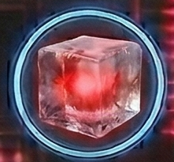</td></tr>
<tr><th colspan="2" style="text-align:center;">General</th></tr>
<tr><td><b>Rarity</b></td><td>exotic</td></tr>
<tr><td><b>Size</b></td><td>2</td></tr>
<tr><td><b>Stackable</b></td><td>Yes</td></tr>
<tr><td><b>Tradeable</b></td><td>Yes</td></tr>
<tr><th colspan="2" style="text-align:center;">Market</th></tr>
<tr><td><b>Base Value</b></td><td>200 cr</td></tr>
</table>

> Radioactive hydrogen isotope ice for high-yield fusion.

[View full page](ore_ice_tritium.md)

---

## Tungsten Ore

<table>
<tr><th colspan="2" style="text-align:center;"><h3>Tungsten Ore</h3></th></tr>
<tr><td colspan="2" style="text-align:center;"></td></tr>
<tr><th colspan="2" style="text-align:center;">General</th></tr>
<tr><td><b>Rarity</b></td><td>uncommon</td></tr>
<tr><td><b>Size</b></td><td>2</td></tr>
<tr><td><b>Stackable</b></td><td>Yes</td></tr>
<tr><td><b>Tradeable</b></td><td>Yes</td></tr>
<tr><th colspan="2" style="text-align:center;">Market</th></tr>
<tr><td><b>Base Value</b></td><td>30 cr</td></tr>
</table>

> Extremely hard metal with the highest melting point of any element.

[View full page](ore_tungsten.md)

---

## Uranium Ore

<table>
<tr><th colspan="2" style="text-align:center;"><h3>Uranium Ore</h3></th></tr>
<tr><td colspan="2" style="text-align:center;"></td></tr>
<tr><th colspan="2" style="text-align:center;">General</th></tr>
<tr><td><b>Rarity</b></td><td>rare</td></tr>
<tr><td><b>Size</b></td><td>2</td></tr>
<tr><td><b>Stackable</b></td><td>Yes</td></tr>
<tr><td><b>Tradeable</b></td><td>Yes</td></tr>
<tr><th colspan="2" style="text-align:center;">Market</th></tr>
<tr><td><b>Base Value</b></td><td>150 cr</td></tr>
</table>

> Radioactive heavy metal for fission reactors and weapons.

[View full page](ore_uranium.md)

---

## Vanadium Ore

<table>
<tr><th colspan="2" style="text-align:center;"><h3>Vanadium Ore</h3></th></tr>
<tr><td colspan="2" style="text-align:center;"></td></tr>
<tr><th colspan="2" style="text-align:center;">General</th></tr>
<tr><td><b>Rarity</b></td><td>uncommon</td></tr>
<tr><td><b>Size</b></td><td>1</td></tr>
<tr><td><b>Stackable</b></td><td>Yes</td></tr>
<tr><td><b>Tradeable</b></td><td>Yes</td></tr>
<tr><th colspan="2" style="text-align:center;">Market</th></tr>
<tr><td><b>Base Value</b></td><td>22 cr</td></tr>
</table>

> Hard transition metal used in high-strength steel alloys.

[View full page](ore_vanadium.md)

---

## Void Essence

<table>
<tr><th colspan="2" style="text-align:center;"><h3>Void Essence</h3></th></tr>
<tr><td colspan="2" style="text-align:center;"></td></tr>
<tr><th colspan="2" style="text-align:center;">General</th></tr>
<tr><td><b>Rarity</b></td><td>exotic</td></tr>
<tr><td><b>Size</b></td><td>2</td></tr>
<tr><td><b>Stackable</b></td><td>Yes</td></tr>
<tr><td><b>Tradeable</b></td><td>Yes</td></tr>
<tr><th colspan="2" style="text-align:center;">Market</th></tr>
<tr><td><b>Base Value</b></td><td>400 cr</td></tr>
</table>

> Crystallized vacuum energy harvested from spatial anomalies. Exclusive to Voidborn territory.

[View full page](ore_void.md)

---

## Water Ice

<table>
<tr><th colspan="2" style="text-align:center;"><h3>Water Ice</h3></th></tr>
<tr><td colspan="2" style="text-align:center;"></td></tr>
<tr><th colspan="2" style="text-align:center;">General</th></tr>
<tr><td><b>Rarity</b></td><td>common</td></tr>
<tr><td><b>Size</b></td><td>1</td></tr>
<tr><td><b>Stackable</b></td><td>Yes</td></tr>
<tr><td><b>Tradeable</b></td><td>Yes</td></tr>
<tr><th colspan="2" style="text-align:center;">Market</th></tr>
<tr><td><b>Base Value</b></td><td>12 cr</td></tr>
</table>

> Frozen water extracted from comets and ice moons. Essential for life support.

[View full page](ore_ice_water.md)

---

## Xenon Gas

<table>
<tr><th colspan="2" style="text-align:center;"><h3>Xenon Gas</h3></th></tr>
<tr><td colspan="2" style="text-align:center;">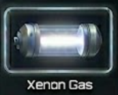</td></tr>
<tr><th colspan="2" style="text-align:center;">General</th></tr>
<tr><td><b>Rarity</b></td><td>uncommon</td></tr>
<tr><td><b>Size</b></td><td>1</td></tr>
<tr><td><b>Stackable</b></td><td>Yes</td></tr>
<tr><td><b>Tradeable</b></td><td>Yes</td></tr>
<tr><th colspan="2" style="text-align:center;">Market</th></tr>
<tr><td><b>Base Value</b></td><td>40 cr</td></tr>
</table>

> Noble gas used in advanced ion thrusters and lighting.

[View full page](gas_xenon.md)

---

## Zinc Ore

<table>
<tr><th colspan="2" style="text-align:center;"><h3>Zinc Ore</h3></th></tr>
<tr><td colspan="2" style="text-align:center;"></td></tr>
<tr><th colspan="2" style="text-align:center;">General</th></tr>
<tr><td><b>Rarity</b></td><td>common</td></tr>
<tr><td><b>Size</b></td><td>1</td></tr>
<tr><td><b>Stackable</b></td><td>Yes</td></tr>
<tr><td><b>Tradeable</b></td><td>Yes</td></tr>
<tr><th colspan="2" style="text-align:center;">Market</th></tr>
<tr><td><b>Base Value</b></td><td>6 cr</td></tr>
</table>

> Corrosion-resistant metal for protective coatings.

[View full page](ore_zinc.md)

---
