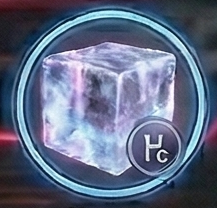

<!-- Auto-generated from crafting.db — do not edit manually -->

<table>
<tr><th colspan="2" style="text-align:center;"><h3>Helium Ice</h3></th></tr>
<tr><td colspan="2" style="text-align:center;">

</td></tr>
<tr><th colspan="2" style="text-align:center;">General</th></tr>
<tr><td><b>Category</b></td><td>ore</td></tr>
<tr><td><b>Rarity</b></td><td>rare</td></tr>
<tr><td><b>Size</b></td><td>2</td></tr>
<tr><td><b>Stackable</b></td><td>Yes</td></tr>
<tr><td><b>Tradeable</b></td><td>Yes</td></tr>
<tr><th colspan="2" style="text-align:center;">Market</th></tr>
<tr><td><b>Base Value</b></td><td>85 cr</td></tr>
</table>

> Frozen helium-3 from gas giant atmospheres. Premium fusion fuel.

## Crafting

### Used In

| Recipe | Qty | Produces |
|--------|-----|----------|
| [Process Helium Ice](refine_helium_ice.md) | 4 | [Helium-3](refined_helium3.md) |
