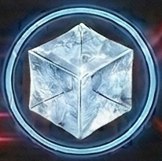

<!-- Auto-generated from crafting.db — do not edit manually -->

<table>
<tr><th colspan="2" style="text-align:center;"><h3>Water Ice</h3></th></tr>
<tr><td colspan="2" style="text-align:center;">

</td></tr>
<tr><th colspan="2" style="text-align:center;">General</th></tr>
<tr><td><b>Category</b></td><td>ore</td></tr>
<tr><td><b>Rarity</b></td><td>common</td></tr>
<tr><td><b>Size</b></td><td>1</td></tr>
<tr><td><b>Stackable</b></td><td>Yes</td></tr>
<tr><td><b>Tradeable</b></td><td>Yes</td></tr>
<tr><th colspan="2" style="text-align:center;">Market</th></tr>
<tr><td><b>Base Value</b></td><td>12 cr</td></tr>
</table>

> Frozen water extracted from comets and ice moons. Essential for life support.

## Crafting

### Used In

| Recipe | Qty | Produces |
|--------|-----|----------|
| [Process Water Ice](refine_water_ice.md) | 5 | [Liquid Hydrogen](refined_hydrogen.md) |
| [Process Water Ice](refine_water_ice.md) | 5 | [Purified Water](refined_water.md) |
